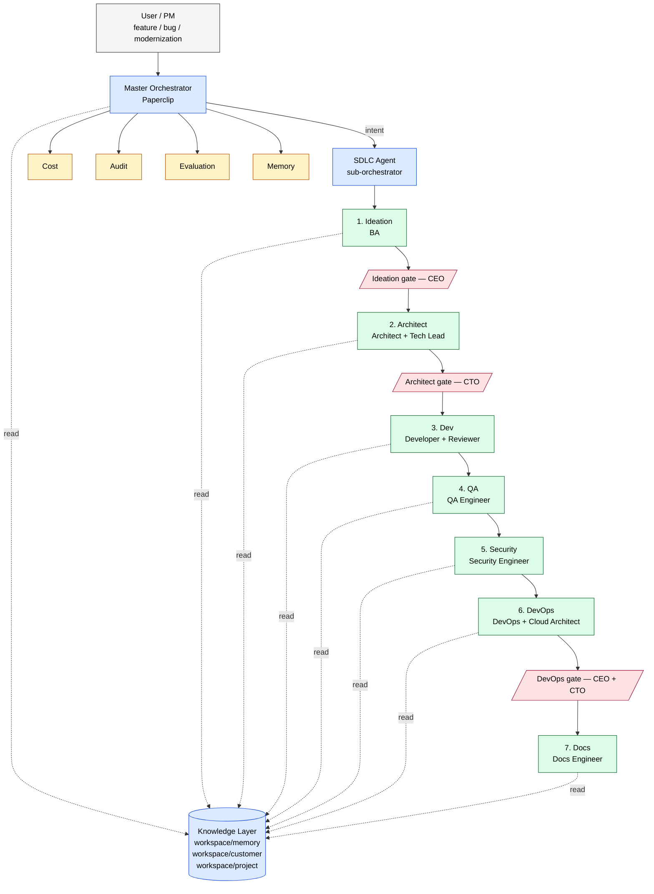

# ADR-0001 — One-Page Architecture Diagram

**Source of truth.** If this file and [ADR-0001](./adr-0001-master-orchestrator-sdlc-architecture.md) §11 ever drift, **this file wins** — re-render the inline copy from here.

**Format.** Mermaid is the primary source. A pure-ASCII fallback follows the Mermaid block for renderers that do not understand Mermaid (Confluence, plain text review, email).

---

## 1. Mermaid (primary)



**Legend**

- **Grey** — user / human.
- **Blue** — orchestrator (Level 0 or Level 1). Never writes code.
- **Yellow** — cross-cutting governance agent (Cost / Audit / Evaluation / Memory).
- **Green** — stage sub-agent team.
- **Red diamond** — human approval gate.

---

## 2. ASCII (fallback)

```
                ┌──────────────────────────┐
                │   User / PM              │   feature / bug /
                │   feature · bug · mod.   │   modernization
                └──────────────┬───────────┘
                               │ trigger
                               ▼
       ╔══════════════════════════════════════════════════╗
       ║  Level 0  Master Orchestrator  (Paperclip)       ║  never writes code
       ║                                                  ║
       ║  session · context · memory · stage trans.       ║
       ║  audit · cost · approvals                        ║
       ╚════════════════┬═════════════╤══════════════════╝
                        │             │
                  intent│       ┌─────┴─────┬─────────┬─────────┐
                        │       ▼           ▼         ▼         ▼
                        │   ┌──────┐    ┌──────┐  ┌──────┐  ┌──────┐
                        │   │ Cost│    │Audit │  │ Eval │  │Memory│   cross-cutting
                        │   └──────┘    └──────┘  └──────┘  └──────┘
                        ▼
       ╔══════════════════════════════════════════════════╗
       ║  Level 1  SDLC Agent  (sub-orchestrator)         ║  never writes code
       ╚════════════════┬═════════════════════════════════╝
                        │
                        ▼
   ┌──────────┐  ┌──────────────┐  ┌──────────┐  ┌──────┐  ┌──────────┐  ┌──────────┐  ┌──────┐
   │1.Ideation│─►│◇ CEO gate    │─►│2.Architect│─►│◇ CTO │─►│3.Dev     │─►│4.QA      │─►│5.Sec  │─►│6.DevOps│─►│◇ CEO+CTO│─►│7.Docs│
   │  BA      │  └──────────────┘  │  Arch+TL  │  │ gate │  │ Dev+Rev  │  │  QA Eng  │  │ SecEng │  │Plat+CA  │  │ gate   │  │Docs │
   └──────────┘                   └──────────────┘  └──────┘  └──────────┘  └──────────┘  └────────┘  └────────┘  └──────┘
        │                              │                │            │              │             │          │         │
        └──────────────────────────────┴────────────────┴────────────┴──────────────┴─────────────┴──────────┴─────────┘
                                                       │
                                                       ▼
                          ┌──────────────────────────────────────────────────┐
                          │  Knowledge Layer                                  │
                          │  workspace/memory   (coding · security · arch ·   │
                          │                     devops)                       │
                          │  workspace/customer (standards · conventions ·    │
                          │                     glossary)                    │
                          │  workspace/project  (PRD · roadmap · tech-stack)  │
                          └──────────────────────────────────────────────────┘
```

---

## 3. How to use

- **PDF / print review** — use the ASCII version with a fixed-width font (Menlo, Consolas, Courier New).
- **Web / Confluence with Mermaid plugin** — use the Mermaid block.
- **Slides** — render the Mermaid block to SVG/PNG (`mmdc -i diagram.mmd -o diagram.png`) and drop into the deck.
- **Code review / PR description** — paste the Mermaid block fenced; GitHub renders it natively.
