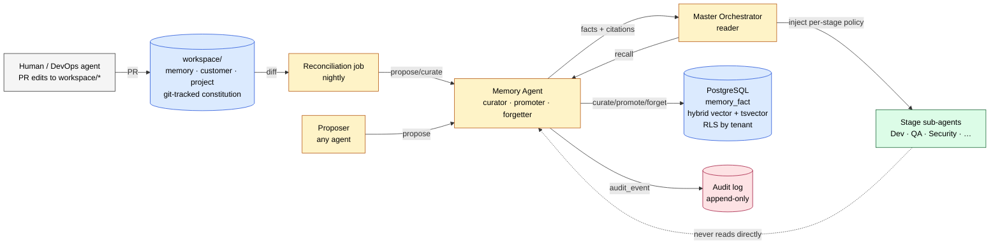

# ADR-0002 — One-Page Memory Store Diagram

**Source of truth.** If this file and [ADR-0002](./adr-0002-memory-store.md) §11 ever drift, **this file wins** — re-render the inline copy from here.

**Format.** Mermaid is the primary source. A pure-ASCII fallback follows the Mermaid block for renderers that do not understand Mermaid (Confluence, plain text review, email).

---

## 1. Mermaid (primary)



**Legend**

- **Grey** — human / external actor.
- **Blue** — persistent store (workspace tree, Postgres).
- **Yellow** — Memory agent and its reconciliation job.
- **Red** — Audit log (append-only, mirrored from every `memory.*` call).
- **Green** — stage sub-agents (read indirectly via Master Orchestrator only).

---

## 2. ASCII (fallback)

```
                ┌──────────────────────────┐
                │  Human / DevOps agent    │
                │  PR edits to workspace/* │
                └────────────┬─────────────┘
                             │ PR
                             ▼
   ┌────────────────────────────────────────────────────┐
   │  workspace/  (git-tracked constitution)           │
   │    memory/  customer/  project/                    │
   └─────────────────────┬──────────────────────────────┘
                         │ nightly diff
                         ▼
                 ┌──────────────────┐         ┌──────────────────────┐
   Proposer ───► │  Memory Agent    │ ──────► │  PostgreSQL          │
   (any agent)   │  curator         │ writes  │  memory_fact         │
                 │  promoter        │ ──────► │  hybrid vector +     │
                 │  forgetter       │         │  tsvector · RLS      │
                 └────────┬─────────┘         └──────────────────────┘
                          │ audit_event
                          ▼
                 ┌──────────────────┐
                 │  Audit log       │  append-only — every memory.*
                 │  (immutable)     │  call mirrored here
                 └──────────────────┘

                          ▲
                          │ recall(query, stage, budget)
                          │ facts + citations
                 ┌────────┴─────────┐
                 │ Master           │
                 │ Orchestrator     │  only reader; injects per stage
                 └────────┬─────────┘
                          │ per-stage policy
                          ▼
                 ┌──────────────────┐
                 │  Stage sub-agents│  Dev · QA · Security · …
                 │  (read indirectly)│  never call Memory directly
                 └──────────────────┘
```

---

## 3. How to use

- **PDF / print review** — use the ASCII version with a fixed-width font (Menlo, Consolas, Courier New).
- **Confluence / Notion / GitHub** — the Mermaid block renders inline.
- **Slide deck** — extract the ASCII block, monospace it, drop into a 16:9 slide.
- **The diagram fits a one-page PDF** at standard A4/Letter with 10pt body text.
