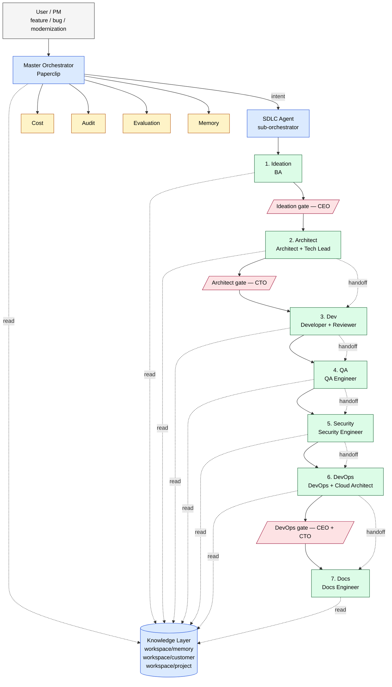

# ADR-0001: Master Orchestrator and SDLC Agent Architecture for the Enterprise AI SDLC Operating System

| Field        | Value                                                          |
|--------------|----------------------------------------------------------------|
| **Status**   | **Accepted**                                                  |
| **Proposed** | 2026-06-16                                                    |
| **Accepted** | 2026-06-16 (CEO sign-off via Paperclip request_confirmation d28e5307) |
| **Author**   | CTO (f4d4bf77-2a6b-41e0-b3c5-4a688e2913f0)                     |
| **Reviewer** | CEO                                                            |
| **Issue**    | [FORA-2](/FORA/issues/FORA-2)                                 |
| **Supersedes** | none                                                         |
| **Superseded by** | none                                                     |

---

## 1. Context

FORA is building an **Enterprise AI SDLC Operating System** on Paperclip + BMAD — not a single coding agent. The company goal document ([FORA-1 goal description](/FORA/issues/FORA-1)) explicitly rejects the "one giant agent" model and proposes an **agent-of-agents** architecture organized around SDLC stages.

A working v1 must answer five hard questions:

1. **Who orchestrates the orchestrators?** Multi-agent systems fail at the seam: which agent decides what runs next, what memory is loaded, and which side effects are allowed?
2. **How is the SDLC decomposed into teams** so a future sub-agent (or human hire) can pick up a clear, scoped charter?
3. **How does a request flow from "user said X" to "merged and deployed X"** without each stage leaking context it should not see?
4. **Where does enterprise knowledge live** so it can be re-injected per stage without polluting the prompt window?
5. **What is the contract between two agents in a handoff** so retries, fallbacks, and audits are deterministic?

This ADR is the first architecture decision record for the system. It establishes the top-level structure. Future ADRs will cover each sub-decision (specific MCP server contracts, the Memory store, the Approval engine, etc.).

## 2. Decision

We adopt a **two-level orchestrator pattern** with a strict no-code policy at the top level:

```
Level 0 — Master Orchestrator (Paperclip)         [never writes code]
            │
Level 1 — SDLC Agent (sub-orchestrator)           [never writes code]
            │
Level 2 — Sub-agent teams                         [write code / artifacts]
   BA, Architect, Tech Lead, Developer, QA, Security, DevOps, Documentation
```

Plus **four cross-cutting agents** (Cost, Audit, Evaluation, Memory) that act as observers and governors across every stage, called out as missing in the CEO's Pillar 1 document.

The end-to-end pipeline is a **fixed, gated stage machine**:

```
Ideation → Architect → Dev → QA → Security → DevOps → Docs
   │          │        │     │       │          │        │
   └──► Human approval gates separate each stage transition
```

All agents read from a single, shared **Knowledge Layer** organized as `workspace/memory/`, `workspace/customer/`, `workspace/project/`, and agents exchange artifacts through a **typed Handoff Contract**.

A one-page diagram is in [`./adr-0001-architecture-diagram.md`](./adr-0001-architecture-diagram.md) and is the source of truth for the visual; the same diagram is embedded inline in §11.

## 3. Master Orchestrator (Level 0)

### 3.1 Responsibilities

The Master Orchestrator is implemented as a Paperclip workflow. It owns the spine of execution and **never produces code, design specs, or business artifacts**. Its six core responsibilities:

| # | Responsibility       | What it owns                                                                                          |
|---|----------------------|-------------------------------------------------------------------------------------------------------|
| 1 | **Session management** | Lifecycle of an SDLC run: trigger intake, identity binding, claim checkout, idempotency, termination. |
| 2 | **Context management** | Per-stage prompt assembly: which Knowledge Layer files, which prior artifacts, which tools are bound to the current agent invocation. |
| 3 | **Memory**            | Read/write access to `workspace/memory/` (curated long-term knowledge) and short-term per-run scratch state. Delegates semantic recall to the Memory agent. |
| 4 | **Stage transitions** | Decides when a stage's exit conditions are met, which agent runs next, and which approval gate (if any) is required between them. |
| 5 | **Audit**             | Every prompt, every tool call, every artifact, every approval is appended to an immutable audit log. No agent can opt out. |
| 6 | **Cost**              | Per-run and per-project token / dollar budgets. Pre-flight estimates, mid-run caps, hard kill on overrun. |
| 7 | **Approvals**         | When a stage hands back an artifact that requires a human decision, the orchestrator pauses, surfaces a request to the CEO (or board), and resumes only on acceptance. |

### 3.2 What the Master Orchestrator does NOT do

- It does not write or edit code, configs, schemas, or docs.
- It does not pick a model for a sub-agent (that is the sub-orchestrator's choice).
- It does not bypass approval gates, even when an agent insists it is "safe."
- It does not load customer data into the prompt window unredacted.

### 3.3 Approval model

Approval gates exist at three points in the pipeline, called out in the CEO's goal document:

| Gate              | Triggered by                              | Approver |
|-------------------|-------------------------------------------|----------|
| **Ideation gate** | Epic / user stories produced             | CEO      |
| **Architect gate**| ADR / HLD / API contract produced         | CTO      |
| **DevOps gate**   | Deployment plan / IaC produced           | CEO + CTO|

The Master Orchestrator implements the gates; it does not decide the policy. Future policy changes (e.g., adding a "Security gate") require an ADR.

## 4. SDLC Agent (Level 1)

### 4.1 Role

The SDLC Agent is a **sub-orchestrator**: it receives a single "build me X" intent from the Master Orchestrator and orchestrates the eight sub-agent teams to produce a working, deployed, documented change. It is still no-code at the top level — it composes sub-agents, never writes code itself.

### 4.2 Sub-agent teams

| Team              | Sub-agent                | Writes                                                | Reads                              |
|-------------------|--------------------------|-------------------------------------------------------|------------------------------------|
| **BA**            | Business Analyst         | Epics, user stories, acceptance criteria              | Customer, project PRD, market      |
| **Architecture**  | Architect                | ADRs, HLD, LLD, sequence diagrams, API contracts, DB schemas | Codebase, architecture memory, project |
|                   | Tech Lead                | Story breakdown, task assignment, dependency graph   | Architect output, codebase         |
| **Engineering**   | Developer                | Code diffs, migrations, unit tests                   | Tasks, architect contracts, coding memory |
|                   | Reviewer                 | Review verdicts, blocking comments                   | Code diff, coding standards        |
| **QA**            | QA Engineer              | Integration tests, e2e tests, test plans             | Code diff, acceptance criteria     |
|                   | Self-Healing Test (v1: read-only) | Selector repair proposals                  | Test artifacts, runtime traces     |
| **Security**      | Security Engineer        | Threat model, secret scan, SBOM, IaC scan, OWASP findings | Code diff, IaC, security memory  |
| **Platform**      | DevOps Engineer          | Dockerfile, Terraform, GitHub Actions, Helm, ArgoCD apps | Code diff, devops memory         |
|                   | Cloud Architect          | Multi-region / multi-cloud plan (when needed)        | Platform memory                    |
| **Docs**          | Documentation Engineer   | README, API docs, CHANGELOG, ADR mirrors              | All artifacts                      |

### 4.3 Cross-cutting agents

These run alongside the SDLC stages and report to the Master Orchestrator:

| Agent            | Responsibility                                                                                              |
|------------------|-------------------------------------------------------------------------------------------------------------|
| **Cost**         | Per-run and per-project token / dollar budgets. Pre-flight estimates, mid-run caps, hard kill on overrun. Flags projects trending over budget. |
| **Audit**        | Immutable log of `who, what, when, why, prompt, response, artifacts, approval`. Append-only, queryable by reviewer. |
| **Evaluation**   | Pipeline health: story completion rate, defect leakage, deployment success, AI acceptance rate, retry rate. |
| **Memory**       | Read/write curator for the Knowledge Layer; decides what to summarize, when to forget, when to promote a fact from project to memory. |

### 4.4 Handoff between sub-agents

Sub-agents never call each other directly. Every handoff is a typed **Handoff Contract** (see §7) routed through the SDLC Agent. This keeps audit and cost attribution clean.

## 5. Staged workflow

The seven stages are sequential by default. Skip-ahead is allowed only with an explicit stage-skip note in the contract (e.g., a docs-only change may skip Dev and DevOps). Parallelism within a stage (e.g., parallel unit tests + parallel security scan) is the sub-orchestrator's choice.

### Stage 1 — Ideation (BA team)

- **Inputs:** Jira, Zendesk, Confluence, GitHub issues, SonarQube, market signals.
- **Outputs:** epic, user_stories, acceptance_criteria, dependencies, effort, risk, tech_debt, architecture_impact.
- **Gate:** Ideation gate (CEO approval).

### Stage 2 — Architect (Architecture team)

- **Inputs:** Ideation output, codebase, `workspace/memory/architecture.md`, `workspace/project/PRD.md`.
- **Outputs:** ADR (delta or new), HLD, LLD, sequence diagrams, API contracts, DB schema, repo structure changes.
- **Gate:** Architect gate (CTO approval).

### Stage 3 — Dev (Engineering team)

- **Inputs:** Architect outputs, `workspace/memory/coding.md`, `workspace/customer/standards.md`.
- **Outputs:** branch with code diff, unit tests, migration scripts, swagger updates, a `ready_for_review` PR.
- **No commits to `main` directly.** PR is the unit of work.

### Stage 4 — QA (QA team)

- **Inputs:** PR diff, acceptance criteria, runtime test environment.
- **Outputs:** integration tests, e2e tests, performance baselines, test plan. Sets `qa_verdict: pass | fail | needs_attention`.

### Stage 5 — Security (Security team)

- **Inputs:** PR diff, IaC, dependency manifest.
- **Constraint:** Independent model. **Never reuses the Dev agent's context window** — fresh invocation, fresh prompt, fresh toolset.
- **Outputs:** threat model, secret scan, dependency scan, IaC scan, OWASP findings, `security_verdict: pass | fail`.

### Stage 6 — DevOps (Platform team)

- **Inputs:** PR diff approved by QA + Security.
- **Outputs:** Dockerfile, Terraform / CloudFormation, GitHub Actions, Helm chart, ArgoCD app.
- **Gate:** DevOps gate (CEO + CTO approval) before any production apply.

### Stage 7 — Docs (Docs team)

- **Inputs:** all prior stage artifacts.
- **Outputs:** README update, API reference, CHANGELOG, release notes, ADR mirror in `/docs/architecture/`.

After Stage 7 the Master Orchestrator closes the run, archives the audit log, and updates the Evaluation agent's counters.

## 6. Knowledge Layer

The Knowledge Layer is the single source of truth for **what an agent is allowed to know**. The Master Orchestrator decides which files are loaded into a sub-agent's context window per stage. Nothing else is.

```
workspace/
├── memory/              # cross-project, long-lived, curated
│   ├── coding.md        # language/framework conventions, do/don't
│   ├── security.md      # secrets policy, OWASP checklist, IaC rules
│   ├── architecture.md  # ADR index, system diagrams, allowed patterns
│   ├── devops.md        # cloud conventions, deploy checklists
│   └── qa.md            # QA stage playbook, test tiers, Security handoff, v2 cost budget
│
├── customer/            # per-customer, versioned, contractually scoped
│   ├── standards.md     # coding style, naming, lint rules
│   ├── conventions.md   # branching, PR review, release process
│   └── glossary.md      # domain terms
│
└── project/             # per-project, current, can be ephemeral
    ├── PRD.md
    ├── roadmap.md
    └── tech-stack.md
```

**Loading rules:**

- `workspace/memory/*` is injected on every stage, scoped to the stage's needs.
- `workspace/customer/*` is injected when a stage writes customer-facing code or copy.
- `workspace/project/*` is injected for every stage in the same run.
- Sub-agents may **read** any file in the workspace but may **write only** to the artifacts specified in their Handoff Contract.
- A sub-agent that needs a file not pre-loaded must request it through a structured `needs_context` block in the contract; the Master Orchestrator decides whether to inject it.

## 7. Agent Handoff Contract

Every inter-agent handoff is a single JSON document conforming to the schema below. The Master Orchestrator signs and persists the contract; the Audit agent indexes it.

```jsonc
{
  "contract": {
    "schemaVersion": "1.0",
    "id": "hnd-<uuid>",
    "createdAt": "<ISO-8601 UTC>",
    "runId": "<paperclip-run-id>",
    "stage": "architect",                    // current stage
    "fromAgent": {
      "id": "agent:architect",
      "team": "architecture",
      "model": "claude-opus-4-8",
      "version": "<agent-revision>"
    },
    "toAgent": {
      "id": "agent:developer",
      "team": "engineering",
      "model": "<resolved-by-sub-orchestrator>",
      "version": "<agent-revision>"
    },
    "intent": "Implement the login API per ADR-0014",
    "inputs": [                              // what to read
      { "type": "adr", "ref": "docs/architecture/adr-0014-login-api.md" },
      { "type": "memory", "ref": "workspace/memory/coding.md" },
      { "type": "customer", "ref": "workspace/customer/standards.md" }
    ],
    "outputs": [                             // what to write
      { "type": "code_diff", "branch": "feat/login-api", "targetRepo": "<repo>" },
      { "type": "unit_tests", "minCoverage": 0.85 },
      { "type": "migration", "up": "migrations/2026_06_16_add_users.sql" }
    ],
    "constraints": {
      "noCommit": true,                      // PR is the unit of work
      "maxTokens": 200000,
      "maxDollars": 5.00,
      "maxWallClockSec": 1800,
      "forbiddenTools": ["production:write", "secrets:read:prod"],
      "requiredChecks": ["lint", "unit_tests"]
    },
    "needsContext": [                        // requested by the from-agent if any
      { "type": "codebase", "ref": "src/auth/*", "reason": "existing pattern reference" }
    ],
    "approval": {
      "required": false,
      "approver": null,
      "evidence": null
    },
    "audit": {
      "promptRef": "<id>",                   // from Audit agent
      "tokenEstimate": 12400,
      "costEstimate": 0.18
    },
    "status": "ready",                       // ready | in_progress | succeeded | failed | rejected
    "failureMode": "abort_with_diagnostic"   // abort_with_diagnostic | retry_once | escalate_to_master
  }
}
```

**Invariants:**

1. A contract is **immutable** once signed. Retries create a new contract referencing the old one.
2. The `toAgent` field is **resolved at handoff time** by the sub-orchestrator; it is not decided by the from-agent.
3. The `forbiddenTools` list is the **ceiling**, not the floor — sub-agents can ask for fewer.
4. The Audit agent appends a record for every transition (`ready → in_progress → succeeded/failed`).
5. A `failed` contract carries a `diagnostic` block; the Master Orchestrator decides retry vs. escalate based on `failureMode` and the Evaluation agent's history for this agent pair.

## 8. Consequences

### Positive

- **Bounded blast radius.** A failure in any one stage is recoverable without restarting the run.
- **Clear ownership.** Each sub-agent team maps 1:1 to a future human hire or a CTO-owned charter (see HIRING_PLAN.md §4).
- **Auditable end-to-end.** Every prompt, tool call, artifact, and approval is captured in the contract trail.
- **Model flexibility.** Each sub-agent can use the model that fits the work (Opus for architecture, Sonnet for routine code, Haiku for test triage) without re-architecting.
- **Replaceable components.** A sub-agent can be swapped for a different implementation as long as it honors the handoff contract.

### Negative / risks

- **Latency overhead.** Seven stages plus approval gates will be slower than a single monolithic agent. We accept this in exchange for auditability and control. The Evaluation agent will surface end-to-end p95 latency; if it exceeds the budget set in the goal document, we revisit.
- **Contract drift.** A mis-specified `outputs` block silently misses an artifact. We mitigate with a contract-completeness check at the Audit agent and with an ADR for any contract-schema change.
- **Memory poisoning.** A bad fact in `workspace/memory/` propagates to every future run. We mitigate with a Memory agent that gates writes and a periodic review cadence (see Memory agent ADR, forthcoming).
- **Cost visibility.** Per-stage cost is observable but the dollar ceiling is policy, not code; the CEO and CTO must agree to override.
- **Vendor coupling.** The Master Orchestrator is a Paperclip workflow. Migrating to a different orchestrator later will require an ADR and a shim layer for the contract schema.

## 9. Alternatives considered

1. **Single mega-SDLC agent.** Rejected: cannot be audited, no isolation between stages, and cannot map to the human org chart.
2. **Flat peer-agent mesh (no orchestrator).** Rejected: deadlocks and conflicting tool permissions at scale; hard to attribute cost and audit.
3. **Per-stage orchestrator with no master.** Rejected: loses the cross-cutting view (Cost, Audit, Evaluation, Memory).
4. **External workflow engine (Temporal / Airflow) instead of Paperclip.** Deferred: Paperclip already gives us agents, audit, and approvals. We re-evaluate only if a stage needs long-running durable execution that Paperclip cannot express.

## 10. Out of scope for this ADR

These are explicitly **future ADRs** and intentionally not decided here:

- MCP server contracts (Jira, GitHub, Confluence, SonarQube, Figma, AWS, Slack/Teams).
- The Memory store implementation (vector DB choice, write policy, TTLs).
- The Approval engine UX and routing.
- The Cost agent's pricing model and per-project budget algorithm.
- The Security agent's threat model framework.
- The Self-Healing Test agent's mutation strategy.

## 11. One-page diagram

The canonical, one-page diagram lives at [`./adr-0001-architecture-diagram.md`](./adr-0001-architecture-diagram.md). It is rendered below for convenience; if the two ever drift, the standalone file is the source of truth.



## 12. Reviewer sign-off

This ADR required **CEO sign-off** before the corresponding sub-decisions (sub-ADRs) were opened and before any MCP server was integrated against this contract. CTO sign-off is recorded as the author.

- [x] **CEO — approved as proposed on 2026-06-16** (Paperclip request_confirmation `d28e5307-c342-452a-93e0-0413a89b4db7`, resolved `accepted` at 2026-06-16T18:26:47Z).

### Follow-up ADRs (opened on acceptance)

- [FORA-12: ADR-0002 — Memory store for the cross-cutting Memory agent](/FORA/issues/FORA-12)
