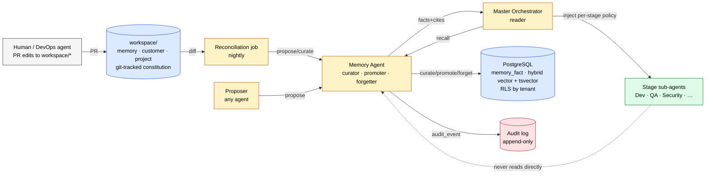

# ADR-0002: Memory Store for the Cross-Cutting Memory Agent

| Field            | Value                                                                                     |
|------------------|-------------------------------------------------------------------------------------------|
| **Status**       | Proposed (in review)                                                                      |
| **Date**         | 2026-06-17                                                                                |
| **Author**       | CTO (f4d4bf77-2a6b-41e0-b3c5-4a688e2913f0)                                                |
| **Reviewer**     | CEO                                                                                       |
| **Issue**        | [FORA-12](/FORA/issues/FORA-12)                                                          |
| **Parent ADR**   | [ADR-0001](./adr-0001-master-orchestrator-sdlc-architecture.md)                          |
| **Supersedes**   | none                                                                                      |
| **Superseded by**| none                                                                                      |

---

## 1. Context

[ADR-0001](./adr-0001-master-orchestrator-sdlc-architecture.md) §4.3 introduces the **Memory** agent as one of the four cross-cutting governance agents (Cost, Audit, Evaluation, Memory). ADR-0001 §3 and §6 leave the implementation of that agent to a follow-on ADR. This is that ADR.

The Memory agent has to answer four questions at runtime, on every stage of every run:

1. **Recall** — given a stage and a query, which facts should be loaded into that stage's prompt window? (ADR-0001 §3.1 row 2 — *Context management*.)
2. **Curate** — which facts are durable, which are stale, which duplicate something already known? (ADR-0001 §4.3 row 4 — Memory's responsibility.)
3. **Promote** — when a fact first appears in one project, then re-appears in another, when does it graduate from `project` to `customer` or `memory`? (ADR-0001 §6 — Knowledge Layer boundaries.)
4. **Forget** — when does a fact expire, get summarized, or get demoted so a stale rule does not poison a future run? (ADR-0001 §8 — "Memory poisoning" risk.)

This ADR decides the **storage substrate**, the **write / read / forget / promote policy**, the **boundary between the git-tracked `workspace/` tree and the runtime Memory store**, the **audit hooks**, and the **per-project cost ceiling** for long-term recall. It does NOT decide the Cost agent's pricing model, the Approval engine's UX, the Security agent's threat model, the Evaluation agent's measurement framework, or the Self-Healing Test agent's mutation strategy — those are explicit out-of-scope.

The acceptance criteria in [FORA-12](/FORA/issues/FORA-12) are: (a) merged in `/docs/architecture/adr-0002-memory-store.md` with CTO + CEO sign-off, (b) a one-page diagram that fits the company goal document, and (c) a worked example showing a fact flowing `write → curate → inject per stage → expire`.

## 2. Decision

We adopt a **single hybrid lexical + vector store on PostgreSQL + pgvector**, fronted by the Memory agent, partitioned into three namespaces (`memory`, `customer`, `project`) that map 1:1 onto the three top-level directories of the Knowledge Layer (ADR-0001 §6).

A fact is the unit of recall. Every fact carries a vector embedding, a tsvector lexical index, a namespace, a scope, a TTL class, a provenance block, and a citation. The Memory agent is the **only writer**; every read and every write is mirrored to the Audit agent's append-only log; per-stage read budgets and per-project monthly budgets bound the cost.

The git-tracked `workspace/{memory,customer,project}/*.md` files are the **human-edited constitution**; the Memory store is the **runtime index** over those files plus agent-proposed facts. A nightly reconciliation job keeps them aligned.

A one-page diagram is in [`./adr-0002-memory-store-diagram.md`](./adr-0002-memory-store-diagram.md) and is the source of truth for the visual; the same diagram is embedded inline in §11.

## 3. Storage substrate

### 3.1 Substrate: PostgreSQL + pgvector + tsvector (hybrid lexical + vector)

| Option                                  | Verdict | Reason                                                                                  |
|-----------------------------------------|---------|-----------------------------------------------------------------------------------------|
| **Pure vector DB** (Pinecone, Weaviate, Qdrant) | Rejected | Strong on semantic recall, weak on precise-term recall (ADR numbers, function names, customer acronyms). Adds a new vendor and a new ops surface. |
| **Hybrid lexical + vector on Postgres + pgvector** | **Chosen** | One transactional store, one backup story, row-level security for customer data, FTS via `tsvector`/`tsquery`, embeddings via `pgvector`. We already operate Postgres for the project metadata, audit log, and most MCP servers. |
| **Graph DB** (Neo4j, Memgraph)          | Deferred | Useful for `depends_on` / `supersedes` / `relates_to` edges between facts. Not justified at v1; the worked example in §10 needs only lexical + vector. If a future ADR adds a graph, it will live alongside, not replace, Postgres. |
| **Embedded on disk** (ChromaDB, LanceDB) | Rejected | Loses multi-tenant isolation, ACID for `propose → curate → promote` transactions, and shared operational tooling. |

### 3.2 Schema (active facts)

```sql
-- One row per fact. Embedding + lexical index side-by-side.
CREATE TABLE memory_fact (
  id              uuid PRIMARY KEY,
  namespace       text NOT NULL CHECK (namespace IN ('memory','customer','project')),
  scope           text NOT NULL,            -- 'global' for memory, customer_id for customer, project_id for project
  tenant_id       text,                     -- null for memory; equals scope for customer / project
  kind            text NOT NULL CHECK (kind IN ('rule','pattern','gotcha','reference','decision','fact')),
  content         text NOT NULL,            -- <= 800 chars; longer content goes to content_ref
  content_ref     text,                     -- optional pointer to a longer file / ADR / doc
  embedding       vector(1536) NOT NULL,    -- text-embedding-3-small or equivalent
  lex_tokens      tsvector NOT NULL,        -- generated column from content + tags
  tags            text[] NOT NULL DEFAULT '{}',
  source          jsonb NOT NULL,           -- {type, ref, snippet?}
  provenance      jsonb NOT NULL,           -- {agentId, runId, contractId, model}
  ttl_policy      text NOT NULL CHECK (ttl_policy IN ('static','sliding','epoch')),
  expires_at      timestamptz,              -- required when ttl_policy = 'static'
  half_life_days  int,                      -- required when ttl_policy = 'sliding' (default 30)
  access_count    int NOT NULL DEFAULT 0,
  last_accessed_at timestamptz,
  state           text NOT NULL CHECK (state IN ('pending','active','summary','archived','forgotten')),
  promoted_from   uuid REFERENCES memory_fact(id),
  redaction_class text NOT NULL DEFAULT 'none' CHECK (redaction_class IN ('none','customer','secret')),
  written_at      timestamptz NOT NULL DEFAULT now(),
  written_by      text NOT NULL            -- agent id of curator (always the Memory agent)
);

CREATE INDEX ON memory_fact USING ivfflat (embedding vector_cosine_ops) WITH (lists = 100);
CREATE INDEX ON memory_fact USING gin (lex_tokens);
CREATE INDEX ON memory_fact (namespace, scope, state);
CREATE INDEX ON memory_fact (expires_at) WHERE ttl_policy = 'static' AND state = 'active';

-- Row-level security: customer and project rows are visible only to their tenant.
ALTER TABLE memory_fact ENABLE ROW LEVEL SECURITY;
CREATE POLICY memory_fact_tenant ON memory_fact
  USING (
    namespace = 'memory'                                 -- org-wide facts are global
    OR (namespace IN ('customer','project') AND tenant_id = current_setting('app.tenant_id'))
  );

-- Append-only audit mirror; written in the same transaction as the fact write.
CREATE TABLE memory_audit (
  id           uuid PRIMARY KEY,
  ts           timestamptz NOT NULL DEFAULT now(),
  actor        jsonb NOT NULL,        -- {agentId, runId, contractId, model}
  operation    text NOT NULL CHECK (operation IN
                ('propose','curate','promote','demote','recall','forget','summarize','reconcile','redact')),
  target       jsonb NOT NULL,        -- fact id, namespace, or query hash
  result       text NOT NULL CHECK (result IN ('ok','denied','redacted','capped','budget_exceeded','error')),
  tokens_in    int NOT NULL DEFAULT 0,
  tokens_out   int NOT NULL DEFAULT 0,
  cost_cents   int NOT NULL DEFAULT 0
);
CREATE INDEX ON memory_audit (ts DESC);
CREATE INDEX ON memory_audit (actor->>'contractId');
```

### 3.3 Why hybrid, not pure vector

The Memory agent must answer queries that contain **identifiers**: ADR numbers, customer acronyms, function names, JIRA keys. Pure vector similarity (cosine over a 1536-dim embedding) routinely misses `ADR-0014` vs `ADR-0041`. The hybrid query is:

```sql
WITH vec AS (
  SELECT id, content, 1 - (embedding <=> $1::vector) AS sim
  FROM memory_fact
  WHERE state = 'active'
    AND (namespace = 'memory' OR tenant_id = $2)
  ORDER BY embedding <=> $1::vector
  LIMIT 50
),
lex AS (
  SELECT id, content, ts_rank(lex_tokens, plainto_tsquery($3)) AS lex
  FROM memory_fact
  WHERE state = 'active'
    AND (namespace = 'memory' OR tenant_id = $2)
    AND lex_tokens @@ plainto_tsquery($3)
  ORDER BY lex DESC
  LIMIT 50
)
SELECT DISTINCT ON (id) id, content,
       0.7 * COALESCE(sim, 0) + 0.3 * COALESCE(lex, 0) AS score
FROM (
  SELECT id, content, sim, NULL::float4 AS lex FROM vec
  UNION ALL
  SELECT id, content, NULL::float4, lex FROM lex
) u
ORDER BY id, score DESC
LIMIT $4;
```

Weights (0.7 vector / 0.3 lexical) are tuned in §8.

## 4. Write policy

### 4.1 The single-writer rule

The Memory agent is the **only** writer to `memory_fact`. Every other agent — Master Orchestrator, SDLC Agent, sub-agents, human via UI — calls `memory.propose(...)` and lets the Memory agent curate, dedupe, embed, TTL, and commit.

Why:

- One chokepoint for the redaction pass (Security agent's contract, ADR-0001 §5).
- One chokepoint for the audit hook (§7).
- One chokepoint for promotion/demotion logic (§4.3, §6).

### 4.2 Roles

| Role          | Holder                                     | Operations                                                   |
|---------------|--------------------------------------------|--------------------------------------------------------------|
| **Proposer**  | Any agent (or human via UI)                | `propose({namespace, kind, content, source, tags})`          |
| **Curator**   | Memory agent                               | validate, dedupe, redact, embed, assign TTL, set state       |
| **Promoter**  | Memory agent + human gate on org-wide moves | `promote(factId, targetNamespace)` (project → customer → memory) |
| **Forgetter** | Memory agent (auto) + human (manual)       | `forget(factId, reason)` — see §6.3                          |
| **Reader**    | Master Orchestrator only                   | `recall(query, stage, budget)` — sub-agents never call Memory directly |

### 4.3 Promote (project → customer → memory)

A fact that first appears as `project` is not automatically promoted. Promotion is gated:

| From → To        | Trigger                                                         | Gate                |
|------------------|------------------------------------------------------------------|---------------------|
| `project` → `customer` | Same fact (≥85% content + same `kind`) observed in 2 distinct projects of the same customer, OR 1 observation + explicit human approval | Memory agent's automatic check; logged to Audit |
| `customer` → `memory` | Same fact observed in 3 distinct customers, OR a CTO request    | CTO sign-off (Architect gate) |
| Any → archive    | TTL expiry (§6.1)                                               | none (automatic)     |

Promotion is **non-destructive**: the source fact is kept with `promoted_from` pointing at it, and a new active fact is created in the target namespace. The old fact's state is set to `summary` and demoted to read-only.

### 4.4 What an agent may NOT do

- An agent may not write directly to `memory_fact`. There is no service account for it.
- An agent may not edit `workspace/memory/*.md`, `workspace/customer/*.md`, or `workspace/project/*.md` files. If an agent wants to change a constitution file, the change goes through the DevOps agent as a PR. (ADR-0001 §6 sub-agents "may write only to the artifacts specified in their Handoff Contract." Constitution files are not in any contract.)
- A sub-agent may not call `memory.recall` directly. The Master Orchestrator is the only reader; it decides which facts to inject for the current stage. (ADR-0001 §6 "A sub-agent that needs a file not pre-loaded must request it through a structured `needs_context` block in the contract.")

## 5. Read policy (per-stage injection)

### 5.1 The Master Orchestrator is the reader

The Master Orchestrator calls `memory.recall(query, stage, budget)` at the start of each stage. The Memory agent returns a ranked list of facts that fits the budget. The Master Orchestrator assembles the prompt, signs the Handoff Contract v1.0, and hands it to the SDLC Agent.

The Handoff Contract v1.0 (ADR-0001 §7) is **backward compatible**: we add one new optional block, no existing field changes. Any future schema change that touches an existing field is a v1.1 ADR.

```jsonc
{
  "contract": {
    "schemaVersion": "1.0",
    // ... unchanged fields ...
    "memoryContext": {                          // NEW optional block (ADR-0002)
      "namespaces": ["memory", "customer"],     // which namespaces the stage is allowed to read from
      "maxRecalls": 5,                          // ceiling for this stage; Master Orchestrator may lower it
      "maxTokens": 3000,                        // ceiling for the whole stage's memory footprint
      "requireCitations": true,                 // every fact must carry source citation
      "denyKinds": ["gotcha"],                  // optional: stage may opt out of certain fact kinds
      "recallQueries": [                        // explicit queries, set by the sub-orchestrator
        "login api entity id strategy"
      ]
    }
  }
}
```

`memoryContext` is the only place where a stage's read budget lives. If the field is missing, the Memory agent applies the default policy in §5.2.

### 5.2 Default per-stage policy

| Stage        | Default namespaces                                    | Default k | Default token cap | Default deny kinds |
|--------------|--------------------------------------------------------|-----------|-------------------|--------------------|
| 1 Ideation   | customer (glossary, conventions), project (PRD)        | 8         | 2 000             | —                  |
| 2 Architect  | memory (architecture), customer (standards), project (tech-stack) | 10 | 3 000 | `gotcha` |
| 3 Dev        | memory (coding, architecture), customer (standards, conventions) | 12 | 4 000 | — |
| 4 QA         | memory (coding), customer (standards)                  | 8         | 2 000             | `gotcha`           |
| 5 Security   | memory (security, architecture), customer (glossary)   | 10        | 3 000             | —                  |
| 6 DevOps     | memory (devops, security), customer (standards)        | 10        | 3 000             | —                  |
| 7 Docs       | memory (architecture, coding), customer (glossary, conventions) | 8 | 2 000 | `gotcha` |

A stage that needs more must justify it through `needsContext` in the Handoff Contract. The Master Orchestrator can grant, deny, or downscope.

### 5.3 Citation rule

Every fact returned by `memory.recall` carries a `source` block: `{type, ref, snippet?}`. The Memory agent never returns a fact without one. The sub-agent's prompt is required to use these citations when it acts on the fact — the Reviewer sub-agent checks citations on every PR review.

## 6. TTL, summarization, and forgetting

### 6.1 Three TTL classes

| Class     | Semantics                                                                                  | When used                                              |
|-----------|--------------------------------------------------------------------------------------------|--------------------------------------------------------|
| `static`  | Expires at `expires_at`. Hard delete (after a 7-day grace period in cold storage).         | Release notes, changelog, time-bound facts.            |
| `sliding` | Each `recall` refreshes `last_accessed_at`. Expires if untouched for `half_life_days`. Default 30. | Run-derived facts, project-specific gotchas.            |
| `epoch`   | No expiry. Protected from auto-archive. Requires manual `forget` to remove.                 | Org-wide architecture, coding, security rules.         |

Every `epoch` fact is **reviewable**: the Memory agent flags it for a quarterly human review (CTO + CEO) with a 1-click "keep / archive" UI in the Knowledge Layer admin tool.

### 6.2 Summarization and demotion

When a `sliding` fact has not been accessed in `3 × half_life_days`, the Memory agent:

1. Compresses the fact's content into a short `summary` (≤120 chars).
2. Creates a parent rule in the same namespace that aggregates the summary.
3. Sets the original fact's state to `summary` (still queryable, but ranked below `active`).

After `6 × half_life_days` with zero access, the fact's state becomes `archived`. The row is moved to a `memory_fact_archive` table (cold storage on S3, queryable only via explicit `include_archived=true`). Active indexes never see archived facts.

### 6.3 Forgetting

`memory.forget(factId, reason)` is a first-class operation, used for:

- **GDPR / right-to-erasure** — the Memory agent cascades the forget: any `customer` fact with `redaction_class='customer'` is hard-deleted, and any `memory` fact whose `content_ref` points to the deleted fact is re-checked by the curator.
- **Manual correction** — a human (CTO, CEO) flags a fact as wrong. The forget reason is mandatory, recorded in the audit log, and a `forgotten` state row is kept (with empty `content`) for 7 years for compliance.
- **Auto-cleanup of `static`-class facts after their grace period** — see §6.1.

A forgotten fact is never silently resurrected by the reconciliation job (§6.4). The job sees a `forgotten` row and does not re-emit it from `workspace/*.md`.

### 6.4 Reconciliation with `workspace/`

`workspace/memory/*.md`, `workspace/customer/*.md`, and `workspace/project/*.md` are the **human-edited source of truth**. The Memory store is the runtime index over them. A nightly reconciliation job:

- Diff each `workspace/<x>/*.md` against the active facts whose `content_ref` points to that file.
- New or changed files → emit `pending` facts (curator promotes them to `active` if the diff is meaningful).
- Deleted files → mark dependent facts as `forgotten` with `reason: 'workspace file removed'`, but only after a 7-day grace period during which a human can veto.

Human edits to `workspace/*.md` therefore propagate to recall without any agent writing to the store.

## 7. Audit hooks

Every `memory.*` operation writes one row to `memory_audit` in the **same transaction** as the underlying fact change. The Audit agent subscribes to the event stream and re-emits to the company-wide audit log.

```jsonc
{
  "id": "aud-<uuid>",
  "ts": "<iso>",
  "actor": {
    "agentId": "agent:memory",
    "runId": "<paperclip-run-id>",
    "contractId": "hnd-<uuid>",
    "model": "claude-opus-4-8"
  },
  "operation": "recall",                          // propose|curate|promote|demote|recall|forget|summarize|reconcile|redact
  "target": {
    "query": "login api entity id strategy",        // or fact id, or namespace
    "queryHash": "<sha256>"
  },
  "result": "ok",                                  // ok|denied|redacted|capped|budget_exceeded|error
  "tokensIn": 1240,
  "tokensOut": 380,
  "costCents": 2
}
```

Invariants:

1. A `memory.*` operation that does not produce an audit row is a **bug**. The Memory agent returns 500 in that case; the Master Orchestrator aborts the run (fail closed).
2. If the Audit agent is unreachable, the Memory agent returns 503 and the Master Orchestrator pauses the run. We never recall a fact without an audit trail.
3. Audit rows are immutable. Corrections are append-only "reversal" rows with `result: 'reversal'`.

## 8. Cost model

The Cost agent (deferred ADR) sets the per-project monthly budget. This ADR only bounds **per-recall** and **per-stage** spend so a runaway recall cannot blow the budget.

| Knob                          | Default        | Override path                              |
|-------------------------------|----------------|--------------------------------------------|
| `maxRecalls` per stage        | see §5.2       | `contract.memoryContext.maxRecalls`        |
| `maxTokens` per stage recall  | see §5.2       | `contract.memoryContext.maxTokens`         |
| `maxTokens` per single fact   | 600            | curator enforced (longer content → `content_ref`) |
| Embedding cache TTL           | 24h, LRU 50 000 vectors | none                              |
| Hybrid weights                | 0.7 vec / 0.3 lex | tuned by Evaluation agent in a follow-up ADR |
| Stage share of run's recall budget | 30%         | `contract.memoryContext.maxRecalls` (overrides) |

A hard ceiling: a stage may not consume more than 30% of the run's recall budget on memory. On exceed, the Memory agent returns `result: 'budget_exceeded'`, the cheapest possible fact (one epoch rule, capped to 200 tokens), and the Master Orchestrator logs a `cost_flag` event for the Cost agent. The recall is not retried.

## 9. Workspace tree vs. Memory store — the boundary

This is the question that came up in the FORA-12 scoping. The rule:

| Lives in `workspace/<x>/*.md`                          | Lives in `memory_fact`                                                |
|--------------------------------------------------------|------------------------------------------------------------------------|
| The **constitution** — what humans have written and approved. | The **runtime index** — what the agents recall at execution time.      |
| Git-tracked, PR-reviewed, code-owner-gated.            | Postgres rows, RLS-gated, never human-edited directly.                 |
| Edited only by humans via PRs (or by the DevOps agent, which opens a PR for human review). | Written only by the Memory agent. Agents propose; Memory agent curates. |
| Slow-changing: weeks to months between edits.          | Fast-changing: every run proposes new facts, every day the reconciler resyncs. |
| The "why" — the long-form reasoning, the ADR links, the design rationale. | The "what" — the rule, pattern, gotcha distilled to a single recallable unit. |

A `workspace/memory/coding.md` line like "All new entities use UUID v7; do not use auto-increment ids" is the constitution. The Memory store will contain a corresponding fact (kind: `rule`, content: "New entities use UUID v7", source: `workspace/memory/coding.md#entity-ids`) that the Dev stage can recall in one query. The constitution has the nuance; the fact has the punch line.

**Boundary tests:**

- A human edits a constitution file → reconciliation produces new facts. No agent writes to the store.
- An agent learns something new about a project → agent proposes; Memory agent curates. The constitution is untouched.
- A customer requests erasure → forget cascades; constitution file is untouched (it is a public internal document).

## 10. Worked example — write → curate → inject per stage → expire

A fact about UUID v7 flows through the system end to end.

### t0 — Project X, Dev stage, developer agent writes a code comment

```ts
// We use UUID v7 for new entity ids; see ADR-0023.
export class Entity { id: string = uuidv7(); }
```

The Developer agent calls:

```ts
memory.propose({
  namespace: "project",
  scope: "project-X",
  kind: "rule",
  content: "Project X uses UUID v7 for new entity ids; older entities may use v4.",
  source: { type: "code", ref: "src/models/Entity.ts:42" },
  tags: ["entity", "uuid", "primary-key"]
});
```

### t0 + 200 ms — Memory agent curates

1. Redaction pass: no customer data, no secrets. `redaction_class: 'none'`.
2. Dedupe: no existing fact in `project-X` matches above 0.92 similarity. New fact.
3. Embed: text-embedding-3-small → 1536-dim vector.
4. Lexical index: `lex_tokens` = tsvector of `content + tags`.
5. TTL: no `expires_at` given, so `sliding`, `half_life_days = 30`.
6. State: `pending` → `active`.
7. Audit row written: `{operation: 'curate', target: {factId: 'mem-...'}, result: 'ok'}`.

### t0 + 5 min — QA stage, Master Orchestrator recall

```ts
memory.recall({
  query: "entity id generation strategy",
  stage: "qa",
  budget: { maxRecalls: 8, maxTokens: 2000 }
});
```

The Memory agent returns two facts, ranked by `0.7·sim + 0.3·lex`:

1. **memory / rule / "Prefer UUID v7 over UUID v4 for new entities; older entities may use v4."** — score 0.81, source: `workspace/memory/coding.md#entity-ids`. (Org-wide rule from the constitution.)
2. **project-X / rule / "Project X uses UUID v7 for new entity ids; older entities may use v4."** — score 0.74, source: `src/models/Entity.ts:42`. (Newly curated project fact.)

Both facts include citations. The Master Orchestrator injects them into the QA agent's prompt within the 2 000-token cap.

### t0 + 30 days — sliding TTL: first warning

`project-X` fact has 0 `recall` hits and 0 `last_accessed_at` updates in 30 days. The Memory agent runs the summarization job:

1. Generates `summary`: "Project X: entities use UUID v7 (since 2026-Q2). No recent access."
2. Sets the fact's state to `summary`. Creates a parent rule in the `project-X` namespace that aggregates it.
3. Audit row: `{operation: 'summarize', target: {factId: 'mem-...'}}`.

The fact is still queryable but ranked below `active`.

### t0 + 60 days — sliding TTL: archive

Still zero access. The Memory agent moves the row to `memory_fact_archive` (cold storage). The active index no longer sees it. Audit row: `{operation: 'summarize', result: 'ok', target: {state: 'archived'}}`.

### t0 + 90 days — separate path: promotion

Project Y writes the same fact:

```ts
memory.propose({
  namespace: "project",
  scope: "project-Y",
  kind: "rule",
  content: "Project Y uses UUID v7 for new entity ids.",
  source: { type: "code", ref: "src/models/Entity.ts:12" }
});
```

The Memory agent detects the cross-project collision (≥0.85 content similarity). Two projects using UUID v7. The Memory agent logs an observation but does not promote yet — the rule is one customer.

Six months later, Project Z at a different customer also uses UUID v7. The Memory agent now has three distinct customers. The Memory agent proposes a promotion:

```ts
memory.promote({
  factId: "mem-<project-Y-uuid>",
  targetNamespace: "memory",
  reason: "Same rule observed in 3 distinct customers"
});
```

The promotion enters the **Architect gate**. CTO reviews and signs off. The Memory agent creates a new `memory`/`global` fact (org-wide rule) and demotes the three project facts to `summary`. Audit rows for both `promote` and the gate decision.

This is a single fact's full lifecycle: **propose → curate → recall (Dev, QA) → summarize → archive → cross-project collision → promote to memory → org-wide recall**. Every transition is auditable, every cost is bounded, every consumer sees only what its stage is allowed to see.

## 11. One-page diagram

The canonical, one-page diagram lives at [`./adr-0002-memory-store-diagram.md`](./adr-0002-memory-store-diagram.md). It is rendered below for convenience; if the two ever drift, the standalone file is the source of truth.



## 12. Schema compatibility with ADR-0001

- **ADR-0001 §6 (Knowledge Layer) — unchanged.** `workspace/memory/`, `workspace/customer/`, `workspace/project/` directories are the human-edited source of truth, exactly as before. The Memory store is an *additional* runtime layer; it does not move or rename any file.
- **ADR-0001 §7 (Handoff Contract v1.0) — backward-compatible addition.** One new optional block, `memoryContext`, is added. No existing field is renamed, removed, or has its semantics changed. The schema version stays at `1.0`. If a future ADR needs to touch an existing field, that is a v1.1 contract ADR.
- **ADR-0001 §5 (Security — no unredacted customer data in prompt window) — strengthened.** Facts with `redaction_class='customer'` are only returned when the recall is from the same `tenant_id`. The redaction pass runs in the Memory agent's curate step, before the fact is ever queryable.

## 13. Consequences

### Positive

- **One chokepoint for write, one for read.** The Memory agent is the only writer; the Master Orchestrator is the only reader. Audit and redaction have one place to plug in.
- **Hybrid recall is precise and semantic.** ADR numbers and function names are found by lexical; "the rule about not using auto-increment ids" is found by vector.
- **Memory poisoning is bounded.** TTL + summarization + manual forget + reconciliation grace period together mean a bad fact does not propagate forever.
- **GDPR / right-to-erasure is a first-class op.** The forget cascade is defined in §6.3, not a footnote.
- **Cost is bounded per recall and per stage.** A runaway recall returns `budget_exceeded` and the cheapest fact, not a $5 000 invoice.

### Negative / risks

- **Postgres + pgvector is one vendor for embeddings.** If a future use case needs billion-scale vector recall, we will need to revisit. At the scale of a single customer's project (10k–100k facts), pgvector is well within budget.
- **The reconciliation job is a background process that can drift.** We mitigate with a 7-day grace period for delete decisions and a quarterly human review of every `epoch` fact.
- **Hybrid weights are guessed.** 0.7 / 0.3 is a starting point. The Evaluation agent (future ADR) measures recall precision per stage and re-tunes.
- **Promotion gates can be slow.** A `customer → memory` promotion requires a CTO sign-off in the Architect gate. This is the right behavior (we do not want a low-quality fact going org-wide overnight), but it is a latency cost.

## 14. Alternatives considered

1. **Pure vector DB (Pinecone).** Rejected: misses identifier queries; adds a vendor.
2. **Graph DB (Neo4j).** Deferred: useful for `relates_to` / `supersedes` edges, but not justified at v1. Can be added alongside Postgres in a future ADR.
3. **Per-agent memory (each sub-agent has its own store).** Rejected: the cross-cutting Memory agent exists precisely to share knowledge across the 7 stages. Per-agent silos would defeat the design in ADR-0001 §4.3.
4. **Memory store as a flat file in the workspace tree.** Rejected: loses transactional writes, RLS, audit hooks, and the redaction chokepoint.
5. **Read directly from `workspace/*.md` at every stage.** Rejected: the workspace tree is the *constitution*; it is the wrong shape for a runtime recall (long-form markdown vs. a tight fact). Reconciliation bridges the two.

## 15. Out of scope (future ADRs)

These are intentionally **not** decided in this ADR:

- The Cost agent's pricing model and per-project budget algorithm (FORA roadmap).
- The Approval engine UX and routing (FORA roadmap).
- The Security agent's threat model framework (FORA roadmap).
- The Evaluation agent's measurement framework for recall precision (FORA roadmap).
- The Self-Healing Test agent's mutation strategy (FORA roadmap).
- Graph layer for `relates_to` / `supersedes` / `depends_on` edges between facts (potential v2 if recall precision demands it).
- Multi-region replication of `memory_fact` (relevant when we onboard the second customer in a different region).

## 16. Reviewer sign-off

This ADR requires **CEO sign-off** before any Memory agent implementation begins. CTO sign-off is recorded as the author.

- [ ] CEO — approve as proposed
- [ ] CEO — approve with comments (see inline notes)
- [ ] CEO — request changes (re-route to CTO with specific deltas)
