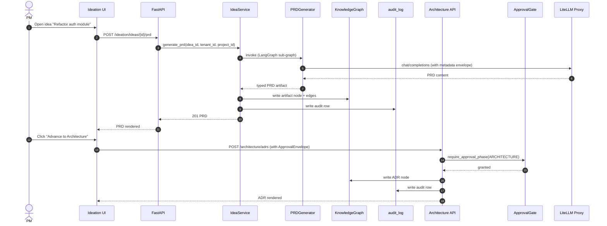
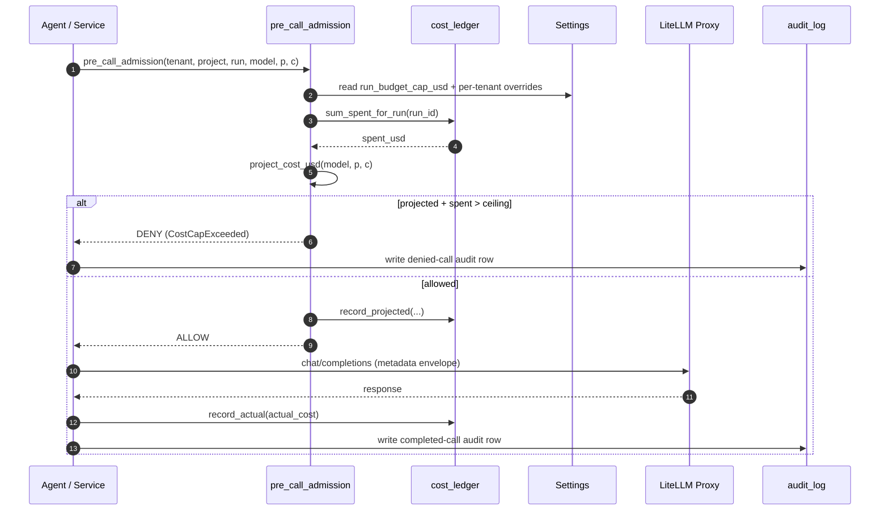
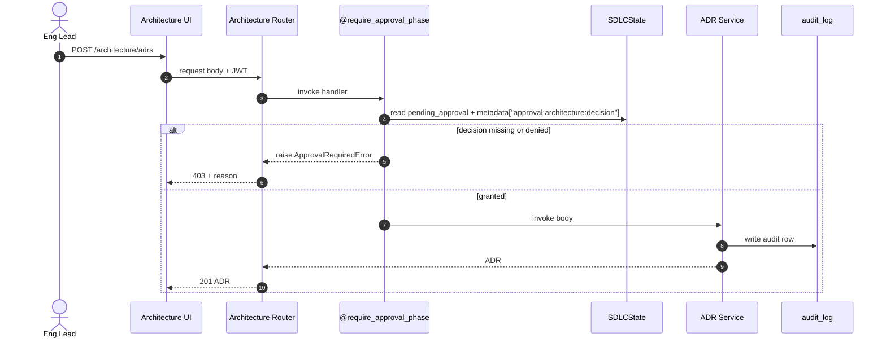

# Forge AI v2.0 MVP — Product Specification

> **Status:** DRAFT v0.1 — awaiting review
> **Date:** 2026-07-04
> **Owner:** Forge Architecture Working Group
> **Mode:** Specification only — no implementation until approved
> **Execution mode:** Parallel team plan (producer + verifier with Claude Code loops)

---

## 0. Document Control

| Version | Date | Author | Change |
|---|---|---|---|
| 0.1 | 2026-07-04 | Mavis (architect role) | Initial draft from clarified scope |

---

## 1. Executive Summary

Forge AI v2.0 MVP is the **dogfood-validated, production-grade, end-to-end working product** built on the existing v2.0 substrate. The milestone replaces every mock/static data path in the UI with real backend wiring, completes Phase 1 Substrate Lock (9 plans), and proves nine core centers — Ideation, Architecture, Runs, Audit, Connector Center, Knowledge Center, Onboarding wizard, Co-pilot, Agent Terminal — work end-to-end on the `acme-corp` seeded tenant with RLS verified and audit clean.

Success bar: an internal pilot user (PM, eng lead, or CTO persona) can complete onboarding in under 30 minutes, ingest a sample repo, generate ideas, advance them through the Architecture gate (with one-click approval), watch every artifact land on the Knowledge Graph, observe the Audit Timeline light up, and run a Co-pilot chat session — all with **zero mock data** in the demo path. The Agent Terminal streams live agent execution over WebSocket.

Execution: parallel team plan with verifier-gated commits. Substrate lands first; centers are wired center-by-center behind per-milestone feature branches; production hardening and dogfood validation close the milestone.

---

## 2. Requirements Discovery

### 2.1 Goal

Ship a working Forge AI v2.0 MVP that is:
- **Production-grade** — RLS verified at the SQL layer, audit completeness enforced, no `[ASSUMED]` libraries, no skipped lint/types
- **End-to-end** — nine core centers wire to real backend; onboarding → ideation → architecture → runs → audit → KG → copilot → terminal flows round-trip without falling back to mock data
- **Dogfood-ready** — usable by an internal pilot user without code changes, with realistic seed data on `acme-corp`

### 2.2 Current State (as of 2026-07-04)

- **Completed:** Phase 0 (hygiene), Phase 0.5 (UI foundation: tokens, shell, StatusPill, DataTable, React Flow nodes, virtualized audit timeline, 5 typed graph views)
- **In flight (recent commits):** Phase 4 wire-up (`forge_phase4` routers: cache, identity, media, ops, passthrough, providers, sessions); LLM wiring pass-through commit on 2026-07-03
- **Wired:** Phase 1 OIDC Auth (2026-06-27), Phase 6 KG Wiring (2026-07-01)
- **Production:** Dashboard, Co-pilot, Agent Center, Projects, Stories, Workflows, Knowledge Center, Ideation, Architecture, Connectors, Onboarding, Governance, Audit, Analytics, Terminal, Runs, Command Center, Settings
- **Static (mock-fallback) files in UI today:** 19 `apps/forge/lib/*/data.ts` files, plus `architecture/mock-fixtures.ts` and `governance-v2/fixtures.ts`
- **Substrate files present:** `approval_gate.py`, `sdlc_state.py`, `litellm_client.py`, `cost_ledger.py`, `merge_gate.py`, `steering_rules.py`, `day_one_bootstrap.py`, `workflow_budget.py`, `code_validator.py` exist; `refactor_agent.py` missing
- **ADR set:** 0001–0008 exist; 009/010/011 not yet authored

### 2.3 Desired State

- Nine centers listed in §3.2 produce and consume real data on every interaction
- Phase 1 Substrate Lock complete (all 9 plans shipped, SUMMARY files generated)
- RLS isolation proven by automated two-tenant smoke test
- Audit log completeness proven by invariant check on every mutating endpoint
- Cost admission enforced before every LLM call with `RunBudgetBadge` visible in UI
- One-click approval gates live for Architecture / Security / Deployment transitions
- Co-pilot streams over SSE with real LiteLLM-backed responses
- Agent Terminal streams live PTY execution over WebSocket with replay
- KG visualization shows live artifact status (draft / approved / conflicted / deployed)
- Demo dogfood script runs end-to-end on `acme-corp` seed without manual intervention

### 2.4 Constraints

- **Constitutional (non-negotiable, FROZEN `.claude/CLAUDE.md`):** 18 rules — provider-agnostic, multi-tenancy, HITL gates, typed artifacts, layer isolation, audit, OTel, configurable, package sourcing, cross-cutting UX, canvas-first, empty-state explainer, onboarding wizard, lifecycle one workflow, docs-are-product
- **Stack pins:** Next.js 16.2.x · React 19 · Tailwind 3.4.14 · Python 3.13 · FastAPI · SQLAlchemy 2 async · Pydantic v2 · PostgreSQL 17 + pgvector + Apache AGE · Redis 7 · Keycloak 26 · LiteLLM Proxy
- **No scope creep** on Tailwind 4, mobile client, external marketplace, real-time CRDT
- **No direct provider SDK imports** anywhere outside `backend/app/integrations/litellm/` (Rule 1; CI grep gate enforces)
- **Append-only migrations** (Alembic) — never edit a merged migration

### 2.5 Dependencies

| Dependency | Status | Risk |
|---|---|---|
| LiteLLM Proxy reachable with valid keys | TBD — verify in M1 | High (blocks all LLM flows) |
| Postgres 17 with Apache AGE + pgvector | Per `docker-compose.yml` | Medium (compose known) |
| Keycloak realm + OIDC config | Per compose | Medium |
| Seed `acme-corp` data realistic enough for demo | Partial — needs enrichment | Medium |
| pnpm + Node 20+ locally | Per `package.json` | Low |
| Python 3.13 + `requirements.txt` | Per `pyproject.toml` | Low |

### 2.6 Resolved Unknowns (from clarifying Qs)

- Demo = **product MVP**, not slideware
- Dogfood = validation skill (real users, real flows)
- Every code path = production-grade (RLS verified, audit clean)
- Scope = the 9 centers + Agent Terminal, all end-to-end
- Execution = **parallel team plan with verifier-gated Claude Code loops**

### 2.7 Open Unknowns

Listed in §15. Resolving these is **not a precondition for implementation** — the spec proceeds with documented assumptions and the team flags blockers during execution.

---

## 3. Functional Specification

### 3.1 User Stories (per persona)

| Persona | Story |
|---|---|
| **PM** | As a PM, I want to onboard a project, ingest signals from Confluence + Slack + Zendesk, and see AI-generated ideas ranked by impact so I can build a defensible roadmap. |
| **Eng Lead** | As an eng lead, I want to advance an idea through Architecture → Security → Deployment with one-click approval and watch the SDLC supervisor run end-to-end without manual code edits. |
| **CTO** | As a CTO, I want a Constitution rulebook page with live green/yellow/red health per rule and a per-run cost view so I can defend the platform in a board review. |
| **Security** | As security, I want every mutating action audited with `{agent, model, prompt, tool, cost, artifact, timestamp, result}` and every Architecture/Security/Deployment crossing gated by a recorded approval. |
| **Customer (internal pilot)** | As an internal pilot user, I want to complete onboarding in under 30 minutes via a single wizard and have one sample repo + one Jira + one LLM provider connected without code changes. |
| **VP Eng** | As VP eng, I want a per-tenant cost ledger, conflict budget, and KG pre-warm so I can plan capacity for the next tenant. |

### 3.2 Acceptance Criteria (per center)

Each center is **dogfood-validated**: the persona's primary flow round-trips with real data on `acme-corp` seed. Mocks are not permitted in the demo path.

#### 3.2.1 Onboarding Wizard
- Single wizard at `/project-onboarding` (not `/onboarding`); 10 UI components mapped to 6 backend steps (`tenant_setup`, `connect_repos`, `detect_stack`, `configure_agents`, `run_first_intel`, `review`)
- Tenant + project + connector + LLM provider selection end-to-end via real backend
- Day-One Bootstrap (F-507) emits a `BootstrapReport` typed artifact
- Resumable across sessions; ends with a tour
- Completes in <30 minutes for an internal pilot user
- **Validation:** manual dogfood run + Playwright e2e

#### 3.2.2 Connector Center
- 7 tabs (Overview, Connected, Marketplace, Credentials, Activity, Health, Webhooks) all hit real backend
- Step 55 zones 4–9 closed: install, disconnect, test, rotate, reveal, sync all hit real endpoints
- Marketplace lists live items from `GET /api/v1/marketplace/connectors`
- Activity polls `GET /api/v1/connectors/activity` every 10s
- Credentials read from `GET /api/v1/connectors/credentials`
- Webhooks read from `GET /api/v1/webhooks`
- Mock `CONNECTORS` array in `data.ts` kept **only** as offline fallback (per spec) with explicit fallback banner
- **Validation:** 12-test backend smoke + Playwright e2e per tab

#### 3.2.3 Ideation
- 9 tabs render real data; no `MOCK_FALLBACK` paths
- Idea ingest from sources (Confluence, Slack, Zendesk) calls real puller services
- Idea scoring, impact comparison, roadmap generation all hit real endpoints
- PRD generator emits typed `PRD` artifact, lands on KG as node
- "Push to Jira" hits real connector with idempotency
- **Validation:** end-to-end: ingest signal → score idea → generate PRD → push to Jira → see in KG

#### 3.2.4 Architecture Center
- 9 tabs render real data; ADR generation emits typed `ADR` artifact
- API Contract generator emits typed `API Contract` artifact
- Risk Register tracks per-ADR risks; Security Report covers deployment risks
- Architecture gate enforced — `BLOCKED_APPROVAL` if no recorded decision
- **Validation:** generate ADR → record approval → advance run → see artifact in KG + audit

#### 3.2.5 Runs
- Live + replay run center; Kanban with status triggers
- `RunBudgetBadge` shows ceiling / spent / remaining before run start
- Cost cap (`run_budget_cap_usd`) enforced; `CostCapExceeded` raised if exceeded
- Approval timeout fires; "Stale approval" badge shown
- **Validation:** start run → hit cost cap → see denial + projected cost → resume after approval

#### 3.2.6 Audit
- Audit Timeline shows `{agent, model, prompt, tool, cost, artifact, timestamp, result}` for every mutation
- Virtualized rendering handles >1000 events smoothly
- Filterable by tenant, project, actor, artifact type, date range
- WORM append-only chain verifiable; daily hash chain exposed
- **Validation:** invariant test: every mutation endpoint writes exactly one audit row

#### 3.2.7 Knowledge Center (KG)
- React Flow visualization with 5 typed nodes (Artifact / RepoFile / Service / AgentStep / Approval)
- Status-colored by tone (draft / approved / conflicted / deployed)
- Bidirectional backlinks (Rule 14); every artifact has outgoing refs + incoming backlinks
- Bidirectional links to Runs and Audit
- **Validation:** approve an Architecture artifact → see node color flip → see audit row → click through to audit detail

#### 3.2.8 Co-pilot
- ⌘J FAB works from every page (Rule 12)
- Streaming chat via SSE backed by LiteLLM Proxy
- Rate-limited per user (`@rate_limit` decorator); pre-call guardrail via `/apply_guardrail`
- Lesson citation chips render real lesson refs
- `useCopilotEnabled()` reads live from `GET /api/v1/system/features`
- **Validation:** end-to-end chat with citation → streaming works → rate limit kicks in after threshold

#### 3.2.9 Agent Terminal
- xterm.js + node-pty via `packages/forge-terminal-server` (no direct `node-pty` import in `apps/forge`)
- WebSocket auth via `api.ws(path)` — auto-injects JWT
- Live PTY session management with replay
- Multi-agent: terminal session per agent
- **Validation:** start a session → run a `forge-*` command → see output stream → replay works

### 3.3 User Flows (happy path + critical edge paths)

**Happy path: PM ingests signals → produces a PRD → pushes to Jira**
1. PM logs in (OIDC) → lands on Dashboard
2. PM opens Onboarding wizard → completes 6 steps → `BootstrapReport` emitted
3. PM navigates to Connector Center → Confluence connector installed
4. PM opens Ideation → Sources tab → Confluence puller runs → ideas land
5. PM opens an idea → Score tab → AI scores → PRD tab generates PRD
6. PRD becomes an Artifact node in KG; Audit row written
7. PM clicks "Push to Jira" → Jira connector fires → PRD linked
8. Co-pilot FAB available throughout (⌘J)

**Critical edge path: cost cap hit mid-run**
1. Eng Lead starts a Run with ceiling $50
2. Mid-run, projected cost + spent > $50
3. `pre_call_admission` returns DENY → `CostCapExceeded` raised
4. Run pauses; UI shows red `RunBudgetBadge` with "Over budget — increase ceiling or stop"
5. Audit row + cost ledger row written for the denied call
6. Eng Lead either: stops run, OR raises per-tenant override via `settings.run_budget_cap_overrides`, OR waits for natural run-end

**Critical edge path: approval timeout**
1. Architecture gate reached; PM approves
2. Security gate pending; PM away for >24h
3. `APPROVAL_EXPIRED` scheduler fires
4. Run paused with "Stale approval" badge
5. Resume requires fresh approval OR escalation to security lead

### 3.4 Success Metrics

| Metric | Target | How measured |
|---|---|---|
| Onboarding time | <30 min | Manual dogfood timing |
| Center wire-up coverage | 9/9 centers hit real backend | `grep -L 'mock\|MOCK' apps/forge/app/<center>/page.tsx` + integration tests |
| RLS isolation | 100% — every cross-tenant query returns 403 or empty | Two-tenant smoke test in CI |
| Audit completeness | 100% — every mutation writes one audit row | Invariant test in pytest |
| Cost admission hit rate | 100% of LLM calls gated | `pre_call_admission` call-site coverage check |
| Page load p95 | <300 ms | Lighthouse CI |
| KG render for 100+ nodes | <1 s | Playwright perf trace |
| Dogfood script duration | <45 min for happy path | Manual run + screenshot evidence |

### 3.5 Edge Cases & Failure Modes

| Failure | Detection | Recovery |
|---|---|---|
| LiteLLM Proxy unreachable | `litellm_health` probe at startup | Refuse to start; surface in `/healthz` |
| Postgres migration drift | Alembic `check` on boot | Refuse to start; log divergence |
| Cost cap exceeded | `pre_call_admission` returns DENY | Pause run; surface budget badge |
| Approval expired | Scheduler fires | Run paused; badge shown |
| LLM call timeout | `httpx` timeout 30s | Retry once with exponential backoff; audit row with `result=timeout` |
| RLS bypass attempt | Two-tenant smoke test | Test fails CI; raise `TenantIsolationError` |
| WS disconnect | Reconnect with backoff | Resume from last server checkpoint |
| KG query >10K nodes | Plan observation in M12 | Offload to NetworkX (NFR-043) |

### 3.6 Out of Scope (this milestone)

- Tailwind 4 migration (post-pilot per HYG-01)
- Per-tenant CMK (tenant #3+ per ADR-011)
- Multi-region active-active LiteLLM (Phase 4)
- Real-time CRDT artifact editing (post-pilot per PRD)
- Public Connector Marketplace (post-pilot per PRD)
- Mobile / native client (v3+ per PRD)
- External pilot customer (per PRD; internal dogfood only)
- Phase 3 (Pilot Volume Scaling) and Phase 4 (Expansion) — separate milestone

---

## 4. Technical Design

### 4.1 Architecture Overview

```
┌──────────────────────────────────────────────────────────────────────────────┐
│  Browser (Next.js 16.2 · React 19 · TS 5.x · Tailwind 3.4.14)               │
│  apps/forge/ — App Router · ⌘J FAB · ⌘K Command Center · TanStack Query     │
└─────────────────────────────────┬────────────────────────────────────────────┘
                                  │ JWT (OIDC) + tenant_id + project_id
                                  ▼
┌──────────────────────────────────────────────────────────────────────────────┐
│  Backend (FastAPI · Python 3.13 · Pydantic v2 · SQLAlchemy 2 async)         │
│  backend/app/                                                                │
│   ├── api/v1/<center>/     thin routers (per-center layout)                  │
│   ├── services/<domain>/   business logic (no free-form dicts)              │
│   ├── agents/              LangGraph SDLC supervisor + sub-graphs           │
│   ├── integrations/litellm/ ONLY place that talks to LiteLLM (Rule 1)       │
│   ├── db/models/           tenant_id+project_id on every model (Rule 2)     │
│   ├── core/                config, security, telemetry, logging             │
│   └── schemas/             Pydantic v2 typed artifacts (Rule 4)             │
└─────────────────────────────────┬────────────────────────────────────────────┘
                                  │ httpx (Rule 1)
                                  ▼
┌──────────────────────────────────────────────────────────────────────────────┐
│  LiteLLM Proxy · Keycloak · Postgres 17 + AGE + pgvector · Redis 7 · Floci  │
└──────────────────────────────────────────────────────────────────────────────┘

Sidecar packages (read-only from app perspective):
  packages/forge-core       skills / agents / commands registry (Rule 9)
  packages/forge-pi         codebase scan, KG, ideation, PRD (Rule 10)
  packages/forge-browser    visual testing, a11y, UAT (Rule 11)
  packages/forge-terminal-server  xterm.js PTY sidecar
  packages/connector-events connector event bus
  packages/mcp-router       MCP multiplexer
```

### 4.2 Component Map

| Layer | Component | Owner rule | Notes |
|---|---|---|---|
| UI | `<CopilotFab />` (⌘J) | R12 | Cross-cutting; reachable from every route |
| UI | `<CommandCenter />` (⌘K) | R12 | Reads `forge-core` registry (R9) |
| UI | `<ConnectorPicker />` | R12 | Reads `useConnectorsOptional()` |
| UI | `StatusPill`, `EmptyState`, `PageHeader`, `SectionCard` | R15 | Phase 0.5 primitives |
| UI | 5 typed React Flow nodes (`Artifact`, `RepoFile`, `Service`, `AgentStep`, `Approval`) | R13, R14 | Phase 0.5-06 |
| UI | `RunBudgetBadge` | R18 (cost admission) | Phase 1 plan 01-02 |
| UI | `AuditTimelineVirtualized` | R7 | Phase 0.5-06 |
| Backend | `@require_approval_phase` | R3 | Phase 1 plan 01-01 |
| Backend | `pre_call_admission` + `CostCapExceeded` | R1, cost | Phase 1 plans 01-02 + 01-09 |
| Backend | `cost_ledger` | R6, ADR-009 | Phase 1 plan 01-09 |
| Backend | `@audit(...)` decorator | R6 | Used on every mutation |
| Backend | OTel auto-instrumentation | R7 | FastAPI + SQLAlchemy + httpx |
| Backend | `BasePhaseNode` | R3 | Writes via `audit_service.record` by default |
| Backend | `ApprovalGateNode` | R3 | LangGraph HITL interrupt |
| Backend | `WorkflowBudget` | NFR-044 | Phase 1 plan 01-07 |
| Backend | `DayOneBootstrap` | F-507 | Phase 1 plan 01-07 |
| Backend | `CodeValidator` sub-graph | F-501 | Phase 1 plan 01-05 |
| Backend | `MergeGate` | F-503 | Phase 1 plan 01-06 |
| Backend | `RefactorAgent` | F-601 | Phase 1 plan 01-08 |
| Backend | `SteeringRulesEngine` | F-504 | Phase 1 plan 01-08 |
| Backend | `tool_bundles.py` | F-505 | Phase 1 plan 01-06 |
| Backend | `ApprovalTimeoutScheduler` | R3, NFR | Phase 1 plan 01-04 |
| Data | Postgres RLS policies | R2 | Every tenant-scoped table |
| Data | Append-only `audit_log` | R6 | Daily hash chain |

### 4.3 Data Flow (Mermaid sequence diagrams)

#### 4.3.1 Ideation → Architecture → KG (happy path)



#### 4.3.2 LLM call with cost admission (PITFALL-2 closure)



#### 4.3.3 Approval gate enforcement (PITFALL-1 closure)



### 4.4 Database Design

#### 4.4.1 Existing core tables (verified present)

`audit_log` · `cost_ledger` (per ADR-009) · `kg_nodes` · `kg_edges` · `approvals` · `runs` · `workflows` · `connectors` · `connector_sync_history` · `ideas` · `adrs` · `api_contracts` · `risk_register` · `security_reports` · `deployment_plans` · `users` · `tenants` · `projects` · `lessons` · `connector_credentials` · `webhooks` · `marketplace_connectors`

#### 4.4.2 Schema invariants (apply to every tenant-scoped table)

```sql
CREATE TABLE example (
  -- ... domain columns ...
  tenant_id    UUID NOT NULL,
  project_id   UUID NOT NULL,
  created_at   TIMESTAMPTZ NOT NULL DEFAULT now(),
  updated_at   TIMESTAMPTZ NOT NULL DEFAULT now(),
  CONSTRAINT pk_example PRIMARY KEY (id)
);

-- Composite index for tenant-scoped queries
CREATE INDEX idx_example_tenant_project ON example (tenant_id, project_id, created_at DESC);

-- Row-Level Security
ALTER TABLE example ENABLE ROW LEVEL SECURITY;
CREATE POLICY tenant_isolation ON example
  USING (tenant_id = current_setting('app.tenant_id')::UUID
     AND project_id = current_setting('app.project_id')::UUID);
```

#### 4.4.3 cost_ledger schema (per ADR-009 — to be authored in M2.9)

| Column | Type | Constraints |
|---|---|---|
| `ledger_id` | UUID | PK, NOT NULL |
| `run_id` | UUID | NOT NULL, FK → runs |
| `tenant_id` | UUID | NOT NULL |
| `project_id` | UUID | NOT NULL |
| `agent` | TEXT | NOT NULL |
| `model` | TEXT | NOT NULL |
| `prompt_tokens` | INTEGER | NOT NULL, CHECK (>= 0) |
| `completion_tokens` | INTEGER | NOT NULL, CHECK (>= 0) |
| `cost_usd` | NUMERIC(12, 6) | NOT NULL, CHECK (>= 0) |
| `projected` | BOOLEAN | NOT NULL |
| `recorded_at` | TIMESTAMPTZ | NOT NULL DEFAULT now() |
| INDEX | `(run_id, projected)` | for `sum_spent_for_run` |
| INDEX | `(tenant_id, project_id, recorded_at DESC)` | for tenant scoping |

#### 4.4.4 Migration plan

- All migrations are **append-only** (Alembic; never edit a merged migration)
- Multi-tenant tables add `tenant_id` (UUID NOT NULL) + `project_id` (UUID NOT NULL) + composite index
- New tables introduced in this milestone:
  - `cost_ledger` (Phase 1 plan 01-09)
  - `approval_log` enhancements if not present
  - `decision_audit` for ADR-010 conflict policy decisions
  - `connector_webhooks`, `connector_activity` for Step 55 zones 4–9

#### 4.4.5 Rollback plan

- Every migration has a paired `downgrade()` that reverses column additions
- For destructive changes (drop column), create a backup table `_<table>_backup_<migration_id>` first
- For data migrations: snapshot via `pg_dump` before applying; rollback = restore snapshot

### 4.5 API Design

#### 4.5.1 Endpoint inventory by center (target state — MVP)

| Center | Method · Path | Auth | Notes |
|---|---|---|---|
| **Onboarding** | `POST /api/v1/onboarding/start` | JWT | Step 1: tenant_setup |
| | `POST /api/v1/onboarding/connect-repos` | JWT | Step 2 |
| | `POST /api/v1/onboarding/detect-stack` | JWT | Step 3 |
| | `POST /api/v1/onboarding/configure-agents` | JWT | Step 4 |
| | `POST /api/v1/onboarding/run-first-intel` | JWT | Step 5 |
| | `POST /api/v1/onboarding/review` | JWT | Step 6 |
| | `GET /api/v1/onboarding/provision/status` | JWT | Step 10 poll |
| **Connector Center** | `GET /api/v1/connectors` | JWT | list (Step 55 zone 1) |
| | `GET /api/v1/marketplace/connectors` | JWT | Step 55 zone 3 |
| | `GET /api/v1/connectors/activity` | JWT | Step 55 zone 4 (poll 10s) |
| | `GET /api/v1/connectors/credentials` | JWT | Step 55 zone 5 |
| | `GET /api/v1/webhooks` | JWT | Step 55 zone 6 |
| | `POST /api/v1/connectors/{id}/install` | JWT | Step 55 zone 7 |
| | `POST /api/v1/connectors/{id}/disconnect` | JWT | |
| | `POST /api/v1/connectors/{id}/test` | JWT | |
| | `POST /api/v1/connectors/{id}/rotate` | JWT | |
| | `POST /api/v1/connectors/{id}/reveal` | JWT | |
| | `POST /api/v1/connectors/{id}/sync` | JWT | |
| **Ideation** | `GET /api/v1/ideation/ideas` | JWT | list |
| | `POST /api/v1/ideation/ideas` | JWT | create |
| | `GET /api/v1/ideation/ideas/{id}` | JWT | detail |
| | `POST /api/v1/ideation/ideas/{id}/score` | JWT | |
| | `POST /api/v1/ideation/ideas/impact/compare?idea_ids=...` | JWT | query params, not body |
| | `POST /api/v1/ideation/ideas/score/batch?idea_ids=...` | JWT | query params, not body |
| | `POST /api/v1/ideation/ideas/{id}/prd` | JWT | emits PRD artifact |
| | `POST /api/v1/ideation/ideas/{id}/arch-preview` | JWT | |
| | `POST /api/v1/ideation/ideas/{id}/push-jira` | JWT | via connector |
| | `GET /api/v1/ideation/roadmaps` | JWT | |
| | `GET /api/v1/ideation/approvals` | JWT | |
| | `GET /api/v1/ideation/workflows` | JWT | |
| | `WS /ws/ideation/{session_id}` | JWT (query `?token=`) | real-time ideation workflow |
| **Architecture** | `GET /api/v1/architecture/adrs` | JWT | list |
| | `POST /api/v1/architecture/adrs` | JWT | gated by `@require_approval_phase(ARCHITECTURE)` |
| | `GET /api/v1/architecture/contracts` | JWT | |
| | `POST /api/v1/architecture/contracts` | JWT | emits API Contract artifact |
| | `GET /api/v1/architecture/risks` | JWT | |
| | `POST /api/v1/architecture/risks` | JWT | |
| | `POST /api/v1/architecture/security-report` | JWT | |
| | `POST /api/v1/architecture/deployment-plan` | JWT | gated by `@require_approval_phase(DEPLOYMENT)` |
| **Runs** | `GET /api/v1/runs` | JWT | list |
| | `POST /api/v1/runs` | JWT | create |
| | `GET /api/v1/runs/{id}` | JWT | detail |
| | `GET /api/v1/runs/{id}/budget` | JWT | `{ceiling_usd, spent_usd, remaining_usd}` |
| | `POST /api/v1/runs/{id}/start` | JWT | gated by `@require_approval_phase(PLANNING)` |
| | `POST /api/v1/runs/{id}/advance` | JWT | gated by phase decorator |
| | `POST /api/v1/runs/{id}/decision` | JWT | records ApprovalEnvelope |
| **Audit** | `GET /api/v1/audit` | JWT | virtualized list |
| | `GET /api/v1/audit/{id}` | JWT | detail |
| | `GET /api/v1/audit/integrity` | JWT | WORM hash chain check |
| **Knowledge Center** | `GET /api/v1/knowledge/nodes` | JWT | paginated |
| | `GET /api/v1/knowledge/edges` | JWT | |
| | `GET /api/v1/knowledge/graph/{artifact_id}` | JWT | |
| | `POST /api/v1/knowledge/search` | JWT | vector + graph hybrid |
| **Co-pilot** | `POST /api/v1/copilot/conversations` | JWT | rate-limited |
| | `POST /api/v1/copilot/conversations/{id}/messages` | JWT | streaming SSE |
| | `POST /api/v1/copilot/conversations/{id}/feedback` | JWT | |
| **Agent Terminal** | `WS /api/v1/terminal/sessions` | JWT (query `?token=`) | xterm.js + PTY |
| | `POST /api/v1/terminal/sessions/{id}/replay` | JWT | |
| **System** | `GET /api/v1/system/features` | JWT (anon-tolerant) | F-800 flags |
| | `GET /healthz` | none | probes: `audit_sink=`, `otel_exporter_configured=`, `litellm_health=` |

#### 4.5.2 Auth & authorization

- OIDC via Keycloak 26 + PKCE; JWT in `Authorization: Bearer`
- Tenant + project scoping: read from JWT claims, **never from query string** (Rule 2)
- RBAC: `forge:admin` short-circuit + JWT permission bundle + `PolicyEngine`
- Permission strings checked in middleware AND in service layer (defense in depth)

#### 4.5.3 Validation

- Pydantic v2 schemas for every request/response (`model_validate` / `model_dump`)
- Tenant + project required on every tenant-scoped signature — `TypeError` if missing
- No `= None` defaults on tenant/project fields

#### 4.5.4 Rate limiting

- Co-pilot: per-user token bucket (`@rate_limit`)
- LLM admission: per-run budget cap (ADR-009)
- WebSocket: per-session message rate cap

#### 4.5.5 Error handling

- Typed errors: `ApprovalRequiredError` (403), `CostCapExceeded` (402), `TenantIsolationError` (403), `UpstreamUnavailable` (503)
- Errors carry `phase`, `run_id`, `tenant_id` context
- Errors write an audit row with `result=error`

#### 4.5.6 Versioning

- All endpoints under `/api/v1/`; breaking changes require `/api/v2/`
- Additive changes (new optional fields, new endpoints) allowed within v1

### 4.6 Frontend Design

#### 4.6.1 Screen inventory

| Route | Center | Status |
|---|---|---|
| `/project-onboarding` | Onboarding wizard | wire |
| `/connector-center` and `/connector-center/[id]` | Connectors | wire (Step 55) |
| `/ideation` | Ideation (9 tabs) | wire |
| `/architecture` | Architecture (9 tabs) | wire |
| `/governance-center` | Approval Timeline | wire |
| `/runs` | Runs | wire |
| `/audit` | Audit Timeline | wire |
| `/knowledge-center` | KG visualization | wire |
| `/knowledge-center/lessons` | Lessons | wire |
| `/copilot` | Co-pilot | wire |
| `/forge-terminal` | Agent Terminal | wire |
| `/dashboard` | Dashboard | wire |
| `/forge-command-center` (⌘K) | Command Center | wire |
| `/personas/{pm,eng-lead,cto}` | Persona dashboards | wire |
| `/admin/llm-gateway` | Admin — LLM Gateway | wire |
| `/admin/seeds` | Admin — Seeds | wire |

#### 4.6.2 Component primitives (Phase 0.5 — already built)

- `StatusPill` (single source of truth for state-bearing chips)
- `EmptyState` (icon + value prop + primary + secondary action)
- `PageHeader`, `SectionCard` (chrome)
- `Shell` (`Sidebar`, `Topbar`, `CommandPalette`, `Breadcrumbs`, `MobileNav`, `PageContainer`)
- `DataTable` (TanStack Table v8)
- `Form` (react-hook-form + zod)
- `Chart` (Recharts; reads CSS variables)
- 5 typed React Flow node components

#### 4.6.3 State management

- **Server state:** TanStack Query (`@tanstack/react-query`)
- **Client state:** Zustand stores per domain (e.g. `useOnboardingStore`, `useIdeationStore`)
- **WebSocket:** `api.ws(path)` from `lib/api/client.ts:267` — auto-injects JWT as `?token=`
- **Auth:** `useAuth()` reads from Keycloak session

#### 4.6.4 Loading / empty / error states (Rule 15)

- **Loading:** skeleton + `StatusPill` showing the expected duration
- **Empty:** icon + value prop + primary CTA + secondary CTA (never bare "No data")
- **Error:** typed `ApiError` → `err.message` in catch; surface retry button; write to error telemetry

#### 4.6.5 Accessibility

- WCAG AA contrast (semantic tokens only — no hex literals per HYG-03)
- Keyboard nav: ⌘J / ⌘K / Tab / Arrow keys for Command Center
- Screen-reader labels on all interactive elements
- `react-joyride` (install) or custom tour for onboarding

#### 4.6.6 Responsive

- Mobile drawer for sidebar (built in Phase 0.5-03)
- All centers work at 360px width
- KG visualization collapses rails on small screens (Rule 13)

#### 4.6.7 Mock fallback policy

- Mock data files in `apps/forge/lib/*/data.ts` retained ONLY when backend returns 5xx AND user has explicit fallback flag
- When fallback is active, show a yellow `StatusPill` "Offline fallback — some data may be stale"
- No mock fallback in demo path; this is enforcement via the dogfood script

### 4.7 Backend Design

#### 4.7.1 Router layout

```
backend/app/api/v1/
├── auth/              OIDC + JWT + tenant context
├── ideation/          9-tab ideation (note orphan-router footgun in CLAUDE.md)
├── architecture/      ADR + API Contract + Risk Register
├── connectors/        Step 55 zones 1-9
├── marketplace/       marketplace list
├── webhooks/          connector webhooks
├── audit/             audit timeline + integrity
├── knowledge/         KG + search
├── runs/              runs + budget
├── workflows/         workflow DAG
├── copilot/           Co-pilot chat + streaming
├── terminal/          Agent Terminal sessions
├── onboarding/        wizard steps
├── governance/        policies + guardrails
├── forge_phase4/      Phase 4 wire-up (cache, identity, media, ops, passthrough, providers, sessions)
├── forge_commands.py  white-label forge-* command map
├── _package_wiring.py registry where every artifact-writing route is decorated with @require_approval_phase
└── system/            features + healthz
```

#### 4.7.2 Service layout

```
backend/app/services/
├── architecture/          ADR + contract services
├── connectors/            connector lifecycle
├── connector_ingestion/   connector ingest pipelines
├── ideation/              ideation + push-to-jira + sources/{confluence,slack,zendesk,synthesizer}
├── memory/                org vs project knowledge boundaries (R5)
├── observability/         tracing + audit (R6, R7)
├── project_intelligence/  KG + codebase scan (R10)
├── project_onboarding/    day_one_bootstrap (F-507)
├── scheduler/             background jobs + jobs/
├── terminal/              PTY sidecar
├── audit_service.py       @audit decorator (R6)
├── cost_ledger.py         ADR-009 schema (Phase 1 plan 01-09)
├── litellm_client.py      chat_complete + pre_call_admission (Phase 1 plans 01-02 + 01-09)
├── merge_gate.py          F-503 (Phase 1 plan 01-06)
├── refactor_agent.py      F-601 (Phase 1 plan 01-08) — MISSING, to be created
├── steering_rules.py      F-504 (Phase 1 plan 01-08)
├── day_one_bootstrap.py   F-507 (Phase 1 plan 01-07)
├── workflow_budget.py     NFR-044 (Phase 1 plan 01-07)
├── forge_commands.py      60+ forge-* → gsd:* white-label map
├── event_bus.py           typed async event bus on Redis Pub/Sub
└── tool_bundles.py        F-505 (Phase 1 plan 01-06) — to be created
```

#### 4.7.3 Agents / LangGraph

```
backend/app/agents/
├── sdlc_agent.py          supervisor (discovery → planning → architecture → implementation → testing → security → review → deployment)
├── approval_gate.py       @require_approval_phase decorator + ApprovalEnvelope + ApprovalRequiredError (Phase 1 plan 01-01)
├── sdlc_state.py          SDLCState (frozen + ApprovalEnvelope metadata)
├── code_validator.py      sub-graph (F-501) — Phase 1 plan 01-05
├── code_validator_nodes/
├── nodes/
├── prompts/
└── tools/
```

#### 4.7.4 LiteLLM integration (Rule 1 — single ingress)

- `backend/app/integrations/litellm/llm_client.py` is the only place that calls LiteLLM Proxy
- Mandatory metadata envelope: `{forge_run_id, forge_agent_id, forge_tenant_id}`
- Pre-call guardrail: `POST /apply_guardrail` before every `chat/completions`
- Streaming (`stream: true`) — final SSE chunk carries `usage` for live cost
- Per-call: `pre_call_admission` → `record_projected` → call → `record_actual`
- Master key server-side only; virtual keys via `POST /key/generate`

### 4.8 Security Considerations

| Concern | Mitigation | Rule |
|---|---|---|
| Direct provider SDK usage | CI grep gate: `import openai\|anthropic\|google.generativeai\|langchain_openai\|cohere\|ollama` fails build | R1 |
| RLS bypass at app layer | Every tenant-scoped signature is keyword-only required (`tenant_id`, `project_id`) — `TypeError` if missing | R2 |
| Phase boundary bypass | `@require_approval_phase` decorator on every artifact-writing handler; CI gate scans for new handlers | R3 |
| Free-form blob artifacts | Typed Pydantic v2 artifacts (`ADR`, `API Contract`, `PRD`, `Risk Register`, `Security Report`, `Deployment Plan`) | R4 |
| Org/Project knowledge bleed | Separate `kg_nodes` rows per scope; RLS-enforced | R5 |
| Audit gap | `@audit(...)` decorator on every mutating endpoint; invariant test asserts completeness | R6 |
| OTel gaps | Auto-instrumentation of FastAPI + SQLAlchemy + httpx; OTLP exporter wired in `docker-compose.yml` | R7 |
| Hardcoded vendor config | `mcp-servers/*` packages + `forge_commands.py` map; no inline strings | R8 |
| Tenant isolation | Two-tenant smoke test in CI; composite indexes on every tenant-scoped table | R2 |
| Cost-cap bypass | `pre_call_admission` before every LLM call; `CostCapExceeded` if exceeded | cost |
| Approval timeout | Scheduler fires on schedule; UI shows "Stale approval" | R3 |
| JWT in WebSocket | `api.ws(path)` auto-injects `?token=`; never hand-build WS URLs | R12 |

### 4.9 Performance Considerations

| Surface | Budget | Mitigation |
|---|---|---|
| Page load p95 | <300 ms | Lighthouse CI gate; bundle splitting |
| KG render (100+ nodes) | <1 s | React Flow + virtualized rails |
| Audit Timeline (>1000 events) | smooth scroll | `AuditTimelineVirtualized` via `@tanstack/react-virtual` |
| Chat first token | <500 ms | SSE streaming via LiteLLM Proxy |
| WebSocket reconnect | <2 s | Backoff + checkpoint resume |
| KG query (10K+ nodes) | handle | Plan observation + NetworkX offload above threshold (NFR-043) |
| LLM admission overhead | <5 ms | Pre-call reads from settings + ledger; no DB write on DENY path |

### 4.10 Observability

- **Tracing:** OTel auto-instrumentation of FastAPI + SQLAlchemy + httpx; OTLP exporter wired in `docker-compose.yml`
- **Logs:** structlog JSON logs with `tenant_id`, `project_id`, `request_id` bound to context
- **Metrics:** per-center counters (idea_created, prd_generated, approval_granted, etc.) + per-tenant cost rollups
- **Audit:** append-only `audit_log` table with daily hash chain (ADR-008)
- **Health:** `/healthz` exposes `audit_sink=`, `otel_exporter_configured=`, `litellm_health=` probes

---

## 5. Milestone Plan

Each milestone is **independently deliverable** with its own branch, AC, and dogfood checkpoint. Estimated effort in engineer-days. Dependencies marked `D→`.

### M1 — Infrastructure & Seed (2 days)

**Scope:** Verify `.env`, seed `acme-corp`, ensure `docker compose up` boots clean end-to-end. Enrich seed data so the demo path has realistic content (10+ ideas, 5+ ADRs, 3+ runs, 50+ audit events, 1 connected Confluence + Slack + Jira).
**Deliverables:**
- `.env` populated with valid LiteLLM keys
- `acme-corp` tenant + `acme-platform` project seeded
- Realistic seed data for demo path
- `docker compose up` boots clean; `/healthz` returns 200 with all probes green
- Documentation: `docs/getting-started.md` updates
**D→** none (foundation)

### M2 — Phase 1 Substrate Lock (10 days)

Subdivided into the 9 plans (each ~1 day). Sequential dependency chain.

- **M2.1** Approval gate decorator + frozen run-state (01-01) — 1 day
- **M2.2** ADR-009 cost ledger schema (01-09 partial) — 0.5 day
- **M2.3** Pre-call cost admission in `litellm_client.py` (01-02) — 1 day  **D→** M2.2
- **M2.4** Audit/OTel default sink wiring (01-03) — 1 day
- **M2.5** Approval timeout scheduler (01-04) — 1 day
- **M2.6** Code Validator sub-graph (01-05) — 1.5 days
- **M2.7** Merge Gate + Tool Bundles (01-06) — 1.5 days
- **M2.8** Workflow Budget + Day-One Bootstrap (01-07) — 1.5 days
- **M2.9** Refactor Agent + Steering Rules (01-08) — 1.5 days
- **M2.10** ADR-010 + ADR-011 (01-09 final) — 0.5 day

Each plan: code + tests + SUMMARY.md + commit on its own branch. CI must pass.

### M3 — Connector Center (Step 55 close-out) (2 days)

**Scope:** Finish Step 55 zones 4–9. Replace remaining mock fallbacks in `apps/forge/lib/connector-center/data.ts` with `useQuery` hooks.
**Deliverables:** 7 tabs on real backend; install/disconnect/test/rotate/reveal/sync on real endpoints; 12-test smoke + Playwright e2e.

### M4 — Ideation (3 days)

**Scope:** All 9 tabs on real backend; idea ingest from sources; PRD generator; push-to-Jira; ideation WebSocket.
**Deliverables:** Per-tab real-data coverage; PRD generator emits typed artifact; integration test for full ingest → score → PRD → push-to-Jira path.

### M5 — Architecture (2 days)

**Scope:** 9 tabs on real backend; ADR + API Contract + Risk Register + Security Report generators; approval gate wired.
**Deliverables:** Per-tab real-data coverage; approval gate E2E test.

### M6 — Runs (2 days)

**Scope:** Live + replay; `RunBudgetBadge`; cost admission live; approval timeout integration.
**Deliverables:** Budget badge visible; cost-cap denial path E2E; stale-approval badge.

### M7 — Audit (1.5 days)

**Scope:** Virtualized timeline; WORM integrity check endpoint; filterable.
**Deliverables:** Timeline renders >1000 events smoothly; invariant test passes; integrity endpoint.

### M8 — Knowledge Center (KG) (2 days)

**Scope:** React Flow viz with 5 typed nodes; status-colored by tone; bidirectional backlinks; vector+graph search.
**Deliverables:** Live artifact status; bidirectional links; search returns real nodes.

### M9 — Onboarding Wizard (2 days)

**Scope:** All 10 UI components + 6 backend steps end-to-end; resumable; tour; sample data on completion.
**Deliverables:** Wizard completes in <30 min for a new internal pilot user; Day-One Bootstrap emits `BootstrapReport`.

### M10 — Co-pilot (2 days)

**Scope:** ⌘J FAB on every page; streaming chat; rate limiting; pre-call guardrail; lesson citation chips.
**Deliverables:** End-to-end chat with real LLM response; rate limit kicks in; citations render.

### M11 — Agent Terminal (1.5 days)

**Scope:** xterm.js + node-pty via `packages/forge-terminal-server`; WebSocket auth via `api.ws(path)`; replay; multi-agent sessions.
**Deliverables:** Live stream + replay; no direct `node-pty` import in `apps/forge`.

### M12 — Production Hardening (3 days)

**Scope:** RLS verification (two-tenant smoke); audit completeness invariant; cost-admission call-site coverage; perf budgets; a11y pass; CI gates green.
**Deliverables:**
- Two-tenant smoke test in CI; blocks merge if RLS violation
- Audit completeness invariant test; blocks merge if any mutation endpoint lacks `@audit(...)`
- Cost admission coverage check (every `chat/completions` call site preceded by `pre_call_admission`)
- Lighthouse CI gate <300 ms p95
- WCAG AA pass on all 9 centers

### M13 — Dogfood Validation (2 days)

**Scope:** Run the dogfood script end-to-end with an internal pilot user. Capture screenshots + timings. Fix anything broken.
**Deliverables:**
- Dogfood script doc with timings
- Screenshot evidence for each AC
- Issues filed and triaged
- Sign-off from pilot user

**Total estimated effort: ~32 engineer-days** (single agent, focused; with parallel team plan ~15-20 calendar days)

---

## 6. Implementation Options

### Option A — Vertical Slice (single agent, sequential)

**Architecture:** One engineer (or one agent session) executes M1 → M13 in order on a single feature branch. Each milestone merges to main before the next starts.
**Advantages:**
- Simplest coordination
- No merge conflicts across milestones
- Easiest to reason about state
**Disadvantages:**
- Slowest calendar time (~32 days sequential)
- Single point of failure
- Verifier blind spots (no independent audit per commit)
**Complexity:** Low
**Maintainability:** Medium (large commits)
**Scalability:** Poor (doesn't parallelize)
**Estimated effort:** 32 calendar days
**Estimated risk:** Medium (no verifier; bugs ship)
**Recommended:** No — too slow for MVP timeline

### Option B — Substrate-First Sequential + Wire Centers in Parallel (two-agent)

**Architecture:** Engineer A executes M1 + M2 (substrate) sequentially. After M2.10 lands, M3-M11 fan out to Engineer A on centers + Engineer B on production hardening tracks.
**Advantages:**
- Substrate correctness guaranteed before wiring
- Centers wire against stable substrate
**Disadvantages:**
- Two agents, but limited parallelism (Engineer A is bottleneck for centers)
- Still no independent verifier
**Complexity:** Medium
**Maintainability:** Good
**Scalability:** Medium
**Estimated effort:** 22 calendar days
**Estimated risk:** Medium (verifier gap)
**Recommended:** No — verifier is required per the spec

### Option C — Parallel Team Plan with Verifier (RECOMMENDED)

**Architecture:**
- **Producer agents** (3-4 parallel) execute center-specific milestones (M3-M11) in worktrees
- **Verifier agent** independently audits each producer commit on a different worktree
- **Orchestrator (this role, in spec mode)** authors the spec, reviews verifier reports, accepts/rejects
- Claude Code loops feed producer agents with the approved spec per center
- Substrate (M2) ships first on a single branch with verifier audits; centers branch off after M2.10 lands
**Advantages:**
- Verifier independence — PITFALLs caught before merge
- Parallelism — 3-4 centers wire concurrently
- Quality bar enforced — no commit merges without verifier sign-off
**Disadvantages:**
- Coordination overhead — orchestrator + verifier + producers must agree on spec
- Merge conflicts possible across parallel worktrees (mitigated by feature isolation)
**Complexity:** High
**Maintainability:** Excellent (small, audited commits)
**Scalability:** Excellent (linear in producer count)
**Estimated effort:** 15-20 calendar days
**Estimated risk:** Low (verifier + small commits)
**Recommended:** **YES** — matches the user's stated execution mode

---

## 7. Recommended Approach

**Option C — Parallel Team Plan with Verifier-gated Claude Code loops.**

Reasoning:
1. User explicitly requested "parallel team plan with verified Claude Code"
2. Verifier independence is the only way to catch PITFALL-1 (approval gate bypass) before it ships
3. Substrate lock (M2) must complete before centers wire; centers are independent enough to parallelize
4. Each center's spec is small enough to fit in one producer session
5. Orchestrator (in spec mode) stays in review until each verifier reports clean

Execution sequencing:
1. Orchestrator authors this spec (in progress) → user approves
2. Orchestrator switches to executor mode; spawns `Coder` + `Verifier` agents via `team` tool
3. Phase 1 substrate (M1 + M2) ships on a single branch with verifier audits per plan
4. After M2.10 lands, centers fan out to parallel producers (M3-M11) with per-center worktrees
5. M12 (production hardening) runs as the final consolidation; verifier checks invariants
6. M13 (dogfood) is a manual session with the orchestrator capturing evidence

---

## 8. Git Strategy

### 8.1 Branch model

```
main                                                ← always green, never directly committed
└── epic/v2-mvp-dogfood                             ← integration branch, merges via PR only
    ├── feat/M1-infra-seed                          ← M1
    ├── feat/M2.1-approval-decorator                ← Phase 1 plans
    ├── feat/M2.2-adr-009
    ├── feat/M2.3-cost-admission
    ├── feat/M2.4-audit-otel-sink
    ├── feat/M2.5-approval-timeout
    ├── feat/M2.6-code-validator
    ├── feat/M2.7-merge-gate
    ├── feat/M2.8-workflow-budget-day-one
    ├── feat/M2.9-refactor-steering
    ├── feat/M2.10-adr-010-011
    ├── feat/M3-connector-center
    ├── feat/M4-ideation
    ├── feat/M5-architecture
    ├── feat/M6-runs
    ├── feat/M7-audit
    ├── feat/M8-knowledge-center
    ├── feat/M9-onboarding
    ├── feat/M10-copilot
    ├── feat/M11-agent-terminal
    ├── feat/M12-production-hardening
    └── fix/*                                         ← hotfix branches off epic
```

### 8.2 Commit conventions

Per `docs/standards/git-workflow.md` + conventional commits:
- `feat(phase1): approval gate decorator + frozen envelope (01-01)`
- `fix(api): repair response_class on copilot 204 routes`
- `test(backend): cover @require_approval_phase decorator`
- `docs(planning): accept ADR-009 cost ledger schema`
- `chore(deps): upgrade sqlmodel`

### 8.3 Merge strategy

- **epic → main:** squash-merge with linear history; PR must have verifier sign-off
- **feature → epic:** squash-merge; require producer + verifier + 1 human reviewer
- **fix → epic:** squash-merge; hotfix path

### 8.4 PR checklist

- [ ] Spec reference (which milestone/plan)
- [ ] Tests added/updated; CI green
- [ ] Lint + typecheck pass (`ruff check`, `tsc --noEmit`)
- [ ] Migration review (if Alembic change): append-only? composite index? RLS policy?
- [ ] Mock fallback policy honored (or removed)
- [ ] Audit completeness: every mutation has `@audit(...)` or rationale
- [ ] Cost admission: every LLM call preceded by `pre_call_admission`
- [ ] No direct provider SDK imports (Rule 1)
- [ ] Tenant + project scoping on every new signature (Rule 2)
- [ ] Typed artifact (Pydantic v2) for every new output (Rule 4)
- [ ] Docs updated (`docs/features/<feature>.md`, `docs-site/src/content/docs/<feature>/index.md`)
- [ ] Verifier report attached + accepted

### 8.5 Review checklist (verifier perspective)

- [ ] Architectural alignment with 18 rules
- [ ] SOLID + Clean Architecture
- [ ] No new dependencies introduced (or [ASSUMED] flagged)
- [ ] No new forbidden imports (Rule 1)
- [ ] RLS verified by two-tenant smoke
- [ ] Audit row on every mutation
- [ ] Cost admission before every LLM call
- [ ] Approval decorator on every artifact-writing handler
- [ ] WebSocket auth via `api.ws(path)` (no hand-built URLs)
- [ ] Empty states follow Rule 15
- [ ] Cross-cutting (FAB, Command Center) preserved (Rule 12)
- [ ] Performance within budgets
- [ ] Documentation complete

### 8.6 Release checklist

- [ ] All M1-M13 deliverables complete
- [ ] All SUMMARY.md files generated
- [ ] `STATE.md` updated to milestone-complete
- [ ] Dogfood script passes end-to-end
- [ ] All CI gates green
- [ ] Verifier reports accepted
- [ ] Pilot user sign-off

### 8.7 Rollback checklist

- [ ] Last-green commit identified
- [ ] Migration downgrades scripted (Alembic `downgrade`)
- [ ] Feature flags (if used) flipped to off
- [ ] Mock fallback (if removed) restored as opt-in
- [ ] Pilot user notified

---

## 9. Validation Strategy

### 9.1 Unit tests

- Backend: `pytest` with `pytest-asyncio` + `httpx.AsyncClient`; coverage on services + routers
- Frontend: `vitest` + React Testing Library; coverage on hooks + state adapters
- Target: ≥80% coverage on new code

### 9.2 Integration tests

- FastAPI: in-process test DB (`TEST_DATABASE_URL`); multi-tenant isolation test
- TanStack Query: `renderWithClient` from existing test infra; `vi.spyOn(globalThis, 'fetch')`
- WebSocket: full WS roundtrip with auth token injection

### 9.3 E2E tests

- Playwright: per-center happy path + 1-2 edge paths
- Wire-up smoke: every center's primary flow hits real backend, asserts on response shape
- Dogfood script: manual run + scripted Playwright trace

### 9.4 Security validation

- **RLS isolation test:** two tenants, assert cross-tenant queries return 403 or empty
- **Audit completeness invariant:** every mutating endpoint writes exactly one audit row
- **No direct SDK imports:** CI grep gate
- **Cost admission coverage:** every `chat/completions` call site preceded by `pre_call_admission`
- **Approval gate coverage:** every artifact-writing handler decorated with `@require_approval_phase`
- **JWT scope:** tenant_id + project_id never accepted from query string

### 9.5 Performance validation

- Lighthouse CI: page load p95 <300 ms
- React Flow KG: 100+ nodes render <1 s
- Audit Timeline: >1000 events smooth scroll
- LLM admission: <5 ms overhead

### 9.6 Accessibility validation

- WCAG AA contrast check (semantic tokens only)
- Keyboard nav on every interactive surface
- Screen-reader labels
- Focus management on modals, FAB, command palette

### 9.7 Regression validation

- Every merged PR runs the full test suite + E2E
- M2 substrate tests must remain green after M3-M11 land
- Visual regression on 5 typed React Flow nodes via `forge-browser`

---

## 10. Risks & Mitigations

| Risk | Severity | Likelihood | Mitigation |
|---|---|---|---|
| LiteLLM Proxy unreachable with valid keys | High | Medium | M1 verifies first; fallback deny with clear error |
| Postgres + Apache AGE + pgvector not booting in CI | High | Low | Verified in docker-compose; document fix steps |
| Seed data too sparse for demo | Medium | High | M1 enriches acme-corp with realistic content |
| Cost cap hit mid-demo | Medium | Low | Pre-set ceiling high enough; have override ready |
| Approval timeout mid-demo | Medium | Low | Use short timeout for demo runs; have escalation contact |
| Verifier + producer disagree on interpretation | Medium | Medium | Orchestrator arbitrates; spec is single source of truth |
| Merge conflicts across parallel producer worktrees | Medium | High | Each center owns its files; minimal cross-cutting changes |
| Mock fallback not removed cleanly | Medium | Medium | Feature flag `MOCK_FALLBACK_ENABLED` default false in prod |
| External pilot customer tries to use it before ready | High | Medium | Block by tenant allowlist + internal-only OIDC realm |
| Tailwind 4 dep creeps in | Low | Low | CI grep gate on package.json + tailwind.config |
| Mobile client requested mid-milestone | Low | Low | Out of scope per PRD; defer |
| Real-time CRDT artifact editing requested | Low | Low | Out of scope; artifact versioning via audit log |

### 10.1 Monitoring

- `/healthz` probes (audit_sink, otel_exporter_configured, litellm_health) every 10s
- OTel traces ship to OTLP collector
- structlog JSON to log aggregator
- Per-center counters in Prometheus format
- Cost ledger rollups per tenant per day
- Audit chain integrity check daily

---

## 11. Deployment Strategy

### 11.1 Local dev (this milestone)

- `docker compose up` from repo root
- `.env` populated with dev LiteLLM keys
- `pnpm dev` for frontend (port 3000)
- `uvicorn app.main:app --reload` for backend (port 8000)
- `pnpm dev:terminal` for terminal sidecar (port 7681)

### 11.2 CI/CD

- `ci-monorepo.yml` — install + lint + typecheck + test
- `ci-backend.yml` — pytest + ruff + alembic check
- `ci-frontend.yml` — vitest + tsc + eslint
- `ci-hygiene-grep.yml` — Rule 1 enforcement + approval decorator coverage
- `ci-seed.yml` — seed-data drift detection
- `ci-drift-detection.yml` — spec/codebase drift
- `cd-staging.yml` — auto-deploy to staging on epic merge
- `cd-production.yml` — manual approval for prod deploy

### 11.3 Staging

- AWS ECS Fargate (per ADR-001)
- RDS PostgreSQL 17 + ElastiCache Redis + Secrets Manager
- OIDC realm shared with prod, separate tenant
- Blue/green deploy post-MVP (not this milestone)

### 11.4 Production rollout (deferred)

- Per ADR-011: single CMK for pilot (tenant #1)
- Per ADR-009: cost ledger mandatory
- Per ADR-010: pilot conflict policy until `tenant_count >= 2`
- Internal pilot users only

---

## 12. Rollback Strategy

### 12.1 Substrate rollback (M2)

- Every PR reverts cleanly via `git revert`
- Alembic migrations have paired `downgrade()`
- `@require_approval_phase` can be removed via decorator introspection if needed
- Cost admission: set `run_budget_cap_usd = 10000` to bypass cap (per-tenant override still works)

### 12.2 Center rollback (M3-M11)

- Each center's feature branch can be reverted independently
- Mock fallback re-enabled via feature flag
- Tenant isolation intact (RLS never weakened)

### 12.3 Database rollback

- `pg_dump` snapshot before every migration
- Alembic `downgrade -1` for single-step
- For destructive changes: restore from snapshot

### 12.4 Feature flag rollback

- `MOCK_FALLBACK_ENABLED` — toggle per deployment
- `COPILOT_STREAMING` — toggle per environment
- Per-tenant overrides via `settings.run_budget_cap_overrides`, `settings.conflict_policy_overrides`

---

## 13. Future Enhancements (deferred)

- Tailwind 4 migration (post-pilot per HYG-01)
- Per-tenant CMK at tenant #3+ (ADR-011)
- Multi-region active-active LiteLLM (Phase 4 per roadmap)
- Real-time CRDT artifact editing (post-pilot)
- Public Connector Marketplace (post-pilot)
- Mobile / native client (v3+)
- Phase 3 Pilot Volume Scaling (separate milestone)
- Phase 4 Multi-Tenant Expansion (separate milestone)

---

## 14. Decision Log

| # | Decision | Rationale | Decided |
|---|---|---|---|
| D-001 | Use `team` tool with producer + verifier + Claude Code loops | User explicitly requested parallel team plan with verified Claude Code | 2026-07-04 |
| D-002 | Scope = 9 centers + Agent Terminal | User clarification | 2026-07-04 |
| D-003 | Production-grade bar (RLS verified, audit clean, no mocks in demo path) | User clarification | 2026-07-04 |
| D-004 | Phase 1 substrate ships first as a single integrated milestone (M2.1-M2.10) | Centers cannot wire against unstable substrate | 2026-07-04 |
| D-005 | Mock fallback retained only with explicit offline banner; never in demo path | User wants production-grade | 2026-07-04 |
| D-006 | Two-tenant RLS smoke test is a CI gate, not a manual check | RLS bypass is a class of bug we cannot afford to ship | 2026-07-04 |
| D-007 | Each center gets its own branch + worktree for parallelism | Centers are independent enough | 2026-07-04 |
| D-008 | Verifier has independent authority to block merges | Producer + verifier independence required | 2026-07-04 |
| D-009 | No new external dependencies without [ASSUMED] flag + human checkpoint | Constitutional slopcheck discipline | 2026-07-04 |
| D-010 | Litellm pre-call admission is mandatory, not optional | PITFALL-2 closure | 2026-07-04 |

---

## 15. Open Questions

These do NOT block implementation — proceed with documented assumptions and flag during execution.

| # | Question | Assumption |
|---|---|---|
| Q-1 | Are valid LiteLLM keys available in `.env` for the demo? | M1 verifies first; if missing, prompt user |
| Q-2 | Does `docker compose up` work cleanly on the pilot user's laptop? | M1 verifies |
| Q-3 | What level of polish does "demo-ready" mean — internal demo or investor-grade? | Internal dogfood per user clarification |
| Q-4 | Should external pilot be blocked at the OIDC realm level? | Yes, via tenant allowlist |
| Q-5 | How long are run cost ceilings set for the demo? | Default $50/run; per-tenant overrides documented |
| Q-6 | Should the Approval Timeline (TS-5) be a separate page or part of Audit? | Per STATE.md: separate page at `/governance-center` |
| Q-7 | Which 3 personas get priority for the dogfood script? | PM, Eng Lead, CTO (per PROJECT.md) |

---

## 16. Review Checklist (before implementation begins)

- [ ] User has reviewed and approved the executive summary
- [ ] Center scope confirmed (9 centers + Agent Terminal)
- [ ] Demo definition confirmed (internal dogfood, production-grade)
- [ ] Execution mode confirmed (parallel team plan with verifier)
- [ ] Open questions resolved or assumptions accepted
- [ ] Decisions logged
- [ ] Risk register acknowledged
- [ ] Milestone plan + effort estimates approved
- [ ] Git strategy approved
- [ ] Validation strategy approved
- [ ] Spec saved to `/workspace/forge-v2-mvp-spec.md`

---

*End of specification — awaiting approval to proceed to implementation.*