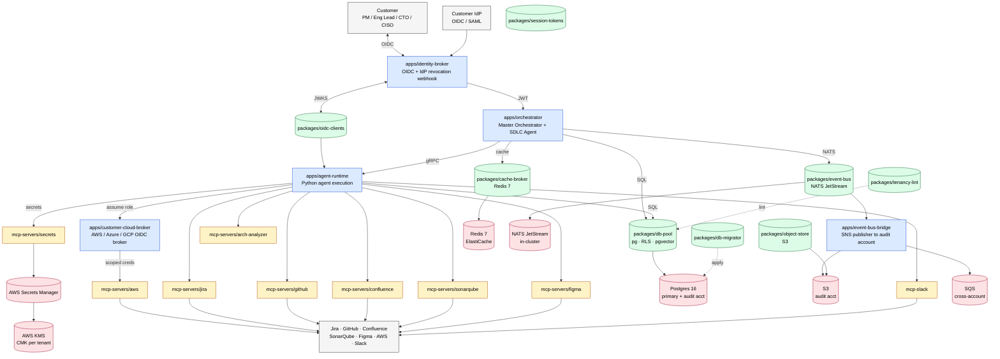

# HLD — FORA Agent-of-Agents Platform

**Stage:** Architect (sub-goal 2.3 of [FORA-18](/FORA/issues/FORA-18))
**Style:** microservices (0.90) + hexagonal-clean (0.80) per `forge/2.2/arch-style-tags.json`
**Owner:** design-generator (CTO on v0.1)
**Last reviewed:** 2026-06-17 (cto)

## 1. System context

FORA is a multi-tenant, agent-of-agents SDLC platform. The customer's PM drops a one-line idea; the platform returns a merged PR, a deploy, a Confluence page, and an audit row per action. The runtime holds the customer's Jira/GitHub/Confluence/AWS/Slack credentials; agents never see them. Every stage transition is a typed, versioned, idempotent handoff (architecture memory §4).

The five in-cluster apps are independently buildable, share nothing across service boundaries (zero cross-service file imports per the codebase graph), and talk to the world only through ports (hexagonal seam). Nine per-tenant MCP servers sit behind a per-tenant egress proxy. Cross-tenant data leakage is a P0; the broker is the only component that may assume a customer role.

## 2. Component diagram (Mermaid)

## 3. NFR table

| NFR | Target | Source | Owner |
| --- | --- | --- | --- |
| **p50 latency, single stage transition** | < 200 ms | architecture memory §8 + ADR-0007 §7 | Orchestrator |
| **p99 latency, single stage transition** | < 1 s | architecture memory §8 | Orchestrator |
| **End-to-end p95, full 7-stage run** | < 90 min wall-clock (median) | PRD §8 guardrail | CTO |
| **Sustained RPS per app (p99 < 2× p50)** | 50 RPS (v1 GA), 250 RPS (v1.1) | architecture memory §8 | App lead |
| **Availability, control plane (orch + identity)** | 99.95 % monthly | PRD §8 + SLO target | DevOps |
| **Availability, MCP servers (per tool)** | 99.5 % monthly (per-tool circuit-breaker) | architecture memory §9 | DevOps |
| **Tenant isolation, cross-tenant leak** | 0 (P0 if it ever happens) | PRD §8 + security memory §4 | Security + CTO |
| **Audit log completeness** | 100 % of agent actions (sample-audited daily) | PRD §8 + security memory §7 | Audit agent |
| **MTTR, customer-impacting incident** | ≤ 60 min | PRD §8 | DevOps on-call |
| **Cost per run, median** | ≤ $5 | PRD §8 + tech-stack §8 | Cost agent |
| **Cost per run, p99** | ≤ $20 | PRD §8 | Cost agent |
| **Cost hard ceiling (pauses, requires human approval)** | $50 / run | PRD §8 + security memory §5 | Orchestrator |
| **Eval regression (safety + quality)** | ≤ 5 % drift weekly | PRD §8 | Eval agent |
| **Data residency, default** | us-east-1 primary + us-west-2 standby | tech-stack §5 | DevOps |
| **Throughput, MCP calls per tenant** | 100 RPS default, 1000 RPS burst | ADR pending (rate-limit policy) | DevOps |
| **Time-to-first-PR, first design partner** | ≤ 12 weeks from kickoff | roadmap §3 | CEO + CTO |
| **Backup model failover (Anthropic → OpenAI)** | < 30 s circuit trip | architecture memory §9 | Cost agent |

## 4. Boundaries (one-way doors)

- **The Orchestrator is the only component that talks to the Agent Runtime, Memory, Cost, and Audit directly.** Sub-agents never bypass it. ([ADR-0001](../docs/architecture/adr-0001-master-orchestrator-sdlc-architecture.md) §2.1)
- **gRPC + proto3 is the internal seam** between Orchestrator and Agent Runtime. JSON over HTTP is forbidden inside the platform. ([ADR-0007](../docs/architecture/adr-0007-grpc-orchestrator-runtime.md) §2)
- **MCP servers live behind a per-tenant egress proxy.** A bug that crosses tenants is a P0. (security memory §4)
- **The audit log is shipped to a separate AWS account.** A compromise of the runtime account cannot rewrite history. (security memory §7)
- **Style override is forbidden unless the PRD explicitly says so.** The detector said microservices 0.90 + hexagonal-clean 0.80; this design conforms. (AC #3)

## 5. Out of scope for this HLD

- Per-service internal class design → LLD (`lld.md`)
- The 7-stage state machine and gate policy → ADR-0001 + `apps/orchestrator/src/gates.ts`
- The audit-log shape → security memory §7.1
- Each MCP server's tool contract → per-tool ADRs in `docs/adr/`
- Cost-ceiling algorithm → Cost agent ADR (forthcoming)

## 6. Linked artefacts

- **LLD** — `forge/2.3/lld.md`
- **ADRs** — `forge/2.3/adr/0001-…` …
- **ERD** — `forge/2.3/erd.mmd`
- **Sequence diagrams** — `forge/2.3/sequence/*.mmd`
- **OpenAPI** — `forge/2.3/openapi.yaml`
- **Inputs** — `workspace/project/PRD.md`, `forge/2.2/arch-style-tags.json`, `forge/2.2/input/codebase-graph.json`
- **Style detector** — `agents/architecture/detector.py` (microbenchmark 2.5 ms, deterministic, $0.00)
- **Parent PRD** — `workspace/project/PRD.md` (v1.0, 2026-06-17)
- **Architecture memory** — `workspace/memory/architecture.md`
- **Security memory** — `workspace/memory/security.md`
- **Tech stack** — `workspace/project/tech-stack.md`

---

**Versioning note:** per architecture memory §5, this HLD is the source of truth for the system's component decomposition at v1. Any change to the five-app topology, the per-tenant MCP boundary, the gRPC seam, or the audit-account boundary is a one-way door and requires an ADR. The CTO signs every one-way-door ADR.
